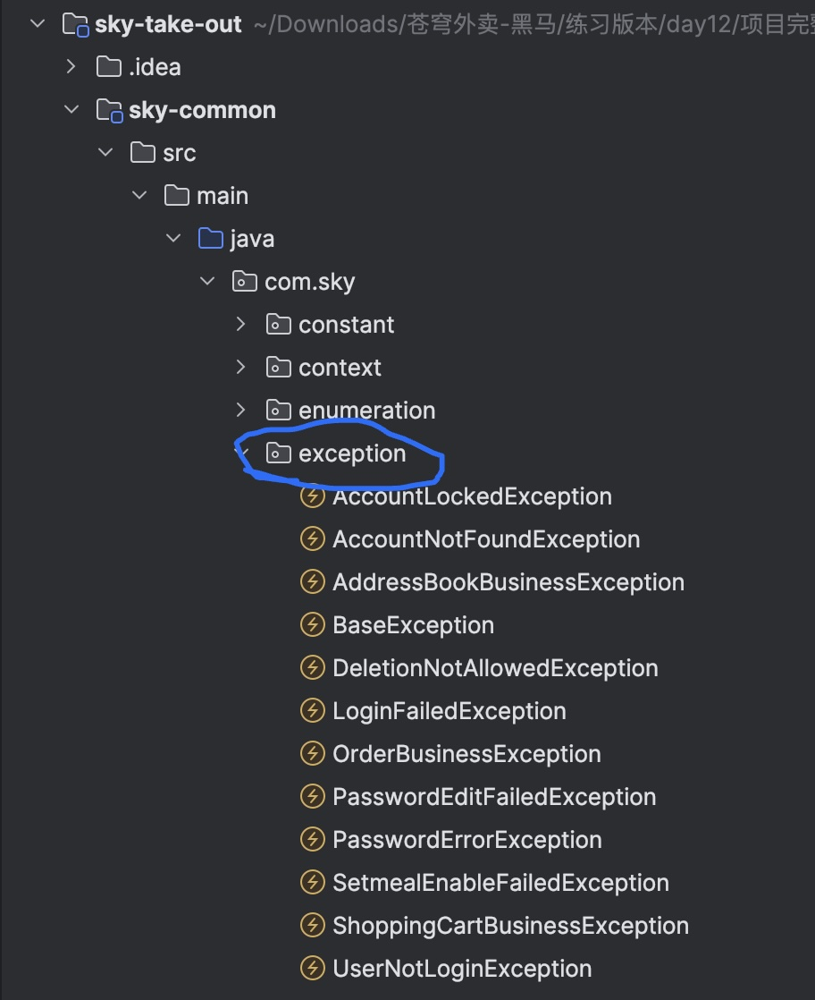

我打开了你这个 GitHub 仓库的首页结构，仓库实际上 **没有 README 内容**（所以没有已有 Markdown 介绍）([GitHub][1])

但我可以根据它的目录给你一个 **标准的项目 README Markdown 模板**，你粘到仓库根目录下 `README.md` 就能变成专业文档：

---

```markdown
# Cangqiongwaimai

> 🍔 苍穹外卖 — 项目代码结构 & 异常设计 & 常量约定（示例说明）

## 📁 目录结构
```


```
StuctureOfCode/
├─ common/
│  ├─ Notes/
│  │  └─ exceptionNotes.md
├─ images/
│  └─ exception.jpg
├─ ...

````

## 🧠 设计规范（核心说明）

### ✅ 常量约定

| 用法 | 示例 |
|------|------|
| 常量类 | `AutoFillConstant`、`JwtClaimsConstant` |
| 优势 | 统一管理、IDE 提示、便于修改 |

---

### 🔒 public static final

| 关键字 | 含义 |
|--------|------|
| `public` | 全局可访问 |
| `static` | 类级别，无需 new |
| `final` | 一次赋值，不可改 |

---

### 🧭 常量对比

| 场景 | 用 enum | 用常量 |
|------|---------|--------|
| 取值是固定集合 | ✔ 强烈推荐 | ✖ 不推荐 |
| 想防止非法值 | ✔ 类型安全 | ✖ 不做到 |
| 只是一串文本/数字 | ✖ 不需要 enum | ✔ 常量最简单 |

---

## 🚨 异常类结构

以下所有业务异常继承自统一 `BaseException`：

```mermaid
classDiagram
direction LR

class RuntimeException
class BaseException {
    +BaseException()
    +BaseException(String message)
}

class AccountLockedException
class AccountNotFoundException
class AddressBookBusinessException
class DeletionNotAllowedException
class LoginFailedException
class OrderBusinessException
class ShoppingCartBusinessException
class PasswordEditFailedException
class PasswordErrorException
class SetmealEnableFailedException
class UserNotLoginException

RuntimeException <|-- BaseException

BaseException <|-- AccountLockedException
BaseException <|-- AccountNotFoundException
BaseException <|-- AddressBookBusinessException
BaseException <|-- DeletionNotAllowedException
BaseException <|-- LoginFailedException
BaseException <|-- OrderBusinessException
BaseException <|-- ShoppingCartBusinessException
BaseException <|-- PasswordEditFailedException
BaseException <|-- PasswordErrorException
BaseException <|-- SetmealEnableFailedException
BaseException <|-- UserNotLoginException
````

---

## 📦 包说明

| 包名            | 存放内容                 |
| ------------- | -------------------- |
| `constant`    | 文本/状态常量              |
| `enumeration` | 枚举类型                 |
| `context`     | ThreadLocal 当前用户等上下文 |
| `exception`   | 自定义业务异常类             |

---

## 💡 异常设计优势

| 优点     | 解释          |
| ------ | ----------- |
| 统一异常结构 | 全局异常处理器统一返回 |
| 语义清晰   | 类名表达业务含义    |
| 方便扩展   | 每个业务域独立异常类  |

---

## 📌 示例业务异常表

| 异常类                           | 场景          |
| ----------------------------- | ----------- |
| `PasswordErrorException`      | 密码错误        |
| `DeletionNotAllowedException` | 不允许删除（关联数据） |

---

## 🛠 开发 & 贡献

欢迎贡献！请遵循以下规范：

* 代码规范：统一异常 + 常量分类
* 提交分支：feature/说明
* 合并请求：PR 至 `main`

```

---

如果你愿意，我还能进一步为你自动生成：

✅ **README 含运行示例 & 构建说明**  
✅ **贡献指南（CONTRIBUTING.md）**  
✅ **代码块 + 错误码表**  
✅ **GitHub 图标 badges**  

只要告诉我你的项目技术栈、运行方式、常见命令等细节，我就能补全。

```::contentReference[oaicite:1]{index=1}```


```
[1]: https://github.com/Hebe-lab-2025/Cangqiongwaimai "GitHub - Hebe-lab-2025/Cangqiongwaimai"
```

很好，这个问题很常用 👍
下面用**简单 + 直接可复制**的方式讲清楚：

---

# 📌 Markdown 引用图片/文件：相对路径 vs 绝对路径

## ✅ 一、相对路径（推荐，随仓库一起移动也不坏）

👉 基于 **当前 Markdown 文件的位置** 计算

### 1）同级目录

```

```

### 2）当前目录下子文件夹

```

```

### 3）返回上一级 `..`

```

```

### 4）返回两级

```

```

👉 你现在这种结构：

```
StuctureOfCode/common/Notes/exceptionNotes.md
StuctureOfCode/images/exception.jpg
```

正确写法：

```

```

---

## ✅ 二、绝对路径（从仓库根目录开始）

📌 只在 **GitHub 仓库内部**有效（不是 URL）

```

```

注意：

* 以 `/` 开头
* 根目录为仓库根

---

## ✅ 三、GitHub Raw 绝对网址（图片直链）

👉 适合 README anywhere & 外部网站使用

```
https://raw.githubusercontent.com/用户名/仓库名/分支/路径
```

你的例子：

```
https://raw.githubusercontent.com/Hebe-lab-2025/Cangqiongwaimai/main/StuctureOfCode/images/exception.jpg
```

Markdown 用法：

```

```

---

## 🔍 小对比

| 方式     | 说明          | 适合场景         |
| ------ | ----------- | ------------ |
| 相对路径   | 随文件移动自动更新   | 推荐大多数情况      |
| 仓库绝对路径 | 从仓库根写       | README 位于根目录 |
| raw 直链 | 真正的 HTTP 地址 | 外部网站 / 文档平台  |

---

## 💡 超链接（文件/目录/代码）

### 链接文件

```
[异常说明](../../images/exception.jpg)
```

### 链接目录

```
[查看 images 目录](../../images/)
```

### 链接到 GitHub 某文件行

```
https://github.com/user/repo/blob/main/path/file.java#L10-L30
```

---

如果你愿意 👉 把：

* 你的 README 位置
* 目标文件路径

发我，我可以 **帮你写出最短正确路径**（100% 不会 404）。


这里是你这张图的 **绝对 GitHub 链接（可 Markdown 引用）**：

```
https://raw.githubusercontent.com/Hebe-lab-2025/Cangqiongwaimai/main/StuctureOfCode/images/exceptions.png
```

👇 对应的 **Markdown 引用方式**：

```

```

📌 如果你想用 **仓库内部绝对路径（从根开始）**：

```

```

---

### 📍 使用场景对照
```
| 引用方式                                                       | 是否适合                        |
| ---------------------------------------------------------- | --------------------------- |
| ``                        | 👍 相对路径（基于当前 Markdown 文件位置） |
| ``              | 👍 仓库内部绝对路径                 |
| `` | 👍 通用，GitHub + 外部平台         |
```
---

需要我给出这张图对应的 **Mermaid classDiagram 自动生成版** 或 **更清晰版本适配 README** 吗？

