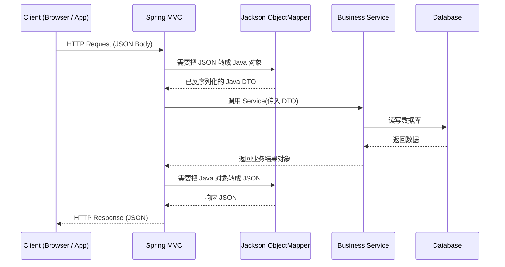

很好，这一句问得特别准 👍
你现在问的是：“自定义序列化 / 反序列化是怎么定义出来的？”

核心就两步：

⸻

✅ 第一步：写“自定义类”——定义规则

📝 自定义序列化（Java → JSON）

例如：手机号脱敏
```
import com.fasterxml.jackson.core.JsonGenerator;
import com.fasterxml.jackson.databind.JsonSerializer;
import com.fasterxml.jackson.databind.SerializerProvider;

import java.io.IOException;

public class PhoneSerializer extends JsonSerializer<String> {

    @Override
    public void serialize(String value, JsonGenerator gen, SerializerProvider serializers)
            throws IOException {

        // 自定义逻辑：中间4位变成****
        String masked = value.replaceAll("(\\d{3})\\d{4}(\\d{4})", "$1****$2");

        gen.writeString(masked);
    }
}
```
📌 这就叫“定义序列化规则”

⸻

📝 自定义反序列化（JSON → Java）

例如：把 "YES"/"NO" 转成 true/false
```
import com.fasterxml.jackson.core.JsonParser;
import com.fasterxml.jackson.databind.DeserializationContext;
import com.fasterxml.jackson.databind.JsonDeserializer;

import java.io.IOException;

public class YesNoBooleanDeserializer extends JsonDeserializer<Boolean> {

    @Override
    public Boolean deserialize(JsonParser p, DeserializationContext ctxt)
            throws IOException {

        String text = p.getText();

        return "YES".equalsIgnoreCase(text);
    }
}
```
📌 这就叫“定义反序列化规则”

⸻

✅ 第二步：注册到 SimpleModule
```
SimpleModule module = new SimpleModule();

module.addSerializer(String.class, new PhoneSerializer());

module.addDeserializer(Boolean.class, new YesNoBooleanDeserializer());

```
⸻

✅ 第三步：注册到 ObjectMapper

```this.registerModule(module);```

这就是：

👉 “自定义逻辑是怎么定义出来的”
👉 你刚才看到那段 LocalDateTime 代码，本质 也是这样定义的

⸻

🎯 你当前项目里的定义属于哪种？

- ✔  自定义日期格式序列化器
- ✔  自定义日期格式反序列化器
- ✔  注册到 JacksonObjectMapper
- ✔  通过 MessageConverter 全局生效

非常标准的企业后端实践。

⸻

🧭 如果你愿意，我可以继续帮你：

你选一个👇

- 1️⃣ 我帮你写【金额保留两位小数】序列化器
- 2️⃣ 我帮你写【密码字段自动脱敏】序列化器
- 3️⃣ 画图解释：请求 JSON 是如何一步步进后端的
- 4️⃣ 面试回答：为什么要自定义 ObjectMapper
- 5️⃣ 改造你的项目支持 统一时区（避免跨国时间错乱）


好，全部给你安排上 ✅，统一用 **Markdown**，直接能丢进 GitHub / 笔记。

---

## 1️⃣ 【金额保留两位小数】序列化器

### 💻 自定义 Serializer（BigDecimal → 保留两位）

```java
import com.fasterxml.jackson.core.JsonGenerator;
import com.fasterxml.jackson.databind.JsonSerializer;
import com.fasterxml.jackson.databind.SerializerProvider;

import java.io.IOException;
import java.math.BigDecimal;
import java.math.RoundingMode;

public class BigDecimalTwoScaleSerializer extends JsonSerializer<BigDecimal> {

    @Override
    public void serialize(BigDecimal value, JsonGenerator gen, SerializerProvider serializers)
            throws IOException {
        if (value == null) {
            gen.writeNull();
            return;
        }
        BigDecimal scaled = value.setScale(2, RoundingMode.HALF_UP);
        // 用字符串输出，避免科学计数法
        gen.writeString(scaled.toString());
    }
}
```

### 📌 字段上使用

```java
import com.fasterxml.jackson.databind.annotation.JsonSerialize;

public class OrderDTO {

    @JsonSerialize(using = BigDecimalTwoScaleSerializer.class)
    private BigDecimal amount;

    // getter / setter ...
}
```

---

## 2️⃣ 【密码字段自动脱敏】序列化器

### 💻 自定义 Password Serializer

```java
import com.fasterxml.jackson.core.JsonGenerator;
import com.fasterxml.jackson.databind.JsonSerializer;
import com.fasterxml.jackson.databind.SerializerProvider;

import java.io.IOException;

public class PasswordMaskSerializer extends JsonSerializer<String> {

    @Override
    public void serialize(String value, JsonGenerator gen, SerializerProvider serializers)
            throws IOException {
        if (value == null) {
            gen.writeNull();
            return;
        }
        // 无论真实密码是什么，都只输出固定掩码
        gen.writeString("******");
    }
}
```

### 📌 在实体上使用

```java
import com.fasterxml.jackson.databind.annotation.JsonSerialize;

public class UserDTO {

    private String username;

    @JsonSerialize(using = PasswordMaskSerializer.class)
    private String password;

    // getter / setter ...
}
```

> 补充：有时也会同时加 `@JsonProperty(access = JsonProperty.Access.WRITE_ONLY)`，只允许前端传入，不返回给前端。

---

## 3️⃣ 请求 JSON 是如何一步步进后端的（图 + 文字）

### 🔁 Mermaid 时序图（可直接放 README）



### 🧠 一句话讲清楚

* 进来时：**JSON → Jackson → Java 对象**
* 出去时：**Java 对象 → Jackson → JSON**
* 你自定义的序列化器 / 反序列化器 = 在这两步中“拦一手做转换逻辑”

---

## 4️⃣ 面试回答：为什么要自定义 ObjectMapper（英文）

你可以直接背这段👇

```text
In my projects I usually customize the ObjectMapper instead of using the default settings.

There are three main reasons:

First, I want full control over date and time formats, for example using "yyyy-MM-dd HH:mm" instead of the ISO default, so that the API payload is consistent with business requirements.

Second, I often add custom serializers and deserializers, such as masking password fields in JSON output or formatting amounts to two decimal places. Doing this centrally in ObjectMapper keeps my controllers and DTOs clean.

Third, I can configure global behaviors like time zone, property naming strategy, and unknown property handling. Overall, a customized ObjectMapper helps me keep JSON contracts stable, improves readability for clients, and reduces boilerplate logic scattered across the codebase.
```

如果要中文速记版：

* 控制时间格式
* 控制金额、密码等序列化逻辑
* 统一时区、命名风格、未知字段处理
  👉 “**让 JSON 规则统一、后端代码更干净**”。

---

## 5️⃣ 改造项目支持统一时区（避免跨国时间错乱）

### 🎯 目标

* 数据库存 **UTC**
* 后端用 **统一时区（通常 UTC）**
* 前端按用户所在时区展示

---

### 🛠 Spring Boot 配置示例（application.yml）

```yaml
spring:
  jackson:
    time-zone: UTC
    date-format: yyyy-MM-dd'T'HH:mm:ss.SSS'Z'
```

### 🛠 启动时设置 JVM 默认时区（可选）

```java
import jakarta.annotation.PostConstruct;
import org.springframework.stereotype.Component;

import java.util.TimeZone;

@Component
public class TimeZoneConfig {

    @PostConstruct
    public void init() {
        TimeZone.setDefault(TimeZone.getTimeZone("UTC"));
    }
}
```

> 这样做的效果：
>
> * 所有 `LocalDateTime` → JSON 时，都按 UTC 输出
> * 跨国部署时，后端不会因为服务器时区不同而“时间飘来飘去”

---

### 📌 小对照表（可以放到笔记里）

```markdown
| 层级 | 建议做法 |
|------|----------|
| 数据库 | 存 UTC 时间（timestamp without time zone） |
| 后端 JVM | 默认时区统一为 UTC |
| Jackson | 统一配置 time-zone 和日期格式 |
| 前端 | 按用户时区本地化展示时间 |
```

---

如果你接下来想继续，我们可以：

* 把“金额两位小数 + 脱敏 + 时间统一”整理成一篇 **《JSON & 时间 & 安全 序列化规范》**
* 或者我帮你基于 **Cangqiongwaimai** 仓库实际目录写一份完整的 `JSON 规范 + 异常规范` 文档，直接当项目总结用。
