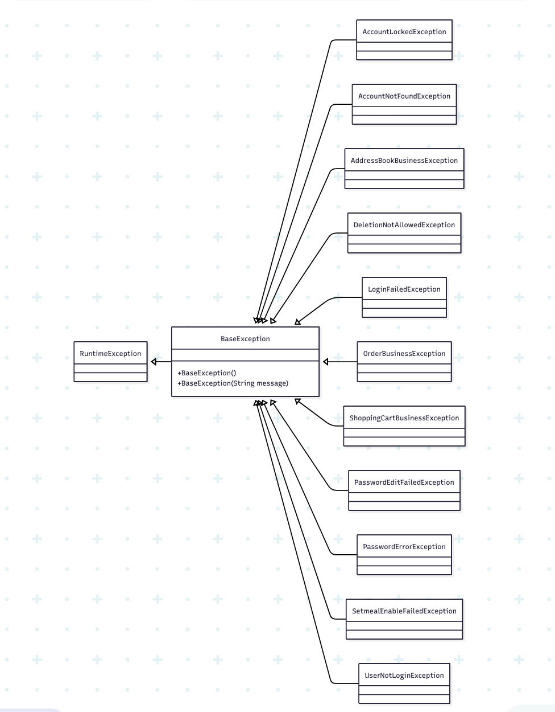

很好，这里说的就是 多态（polymorphism）：
- 👉 “子类对象可以被当作父类类型来使用”。




```

```
我们直接用你项目里的异常体系举例。

⸻

✅ 例子一：子类当父类来接收（引用多态）

```BaseException e = new OrderBusinessException("order error");```

解释：
```
- OrderBusinessException 是 子类
- BaseException 是 父类
- 但我们可以用 父类类型引用子类对象

- 👉 这就叫 向上转型（upcasting）
```
⸻

✅ 例子二：统一处理所有子类异常（多态的真正价值）
```
try {
    throw new ShoppingCartBusinessException("cart empty");
} catch (BaseException e) {
    System.out.println("Handled as BaseException: " + e.getMessage());
}
```
虽然抛的是：

```ShoppingCartBusinessException（子类）```

但是捕获的是：

```BaseException（父类）```

- 👉 依然能正确处理
- 👉 这就是 子类当父类用

⸻

📌 对照你的继承树理解
```
RuntimeException
   ↑
BaseException
   ↑
OrderBusinessException
   ↑
ShoppingCartBusinessException
```
所以以下都是合法的：
```
BaseException a = new OrderBusinessException("x");

BaseException b = new ShoppingCartBusinessException("y");

OrderBusinessException c = new ShoppingCartBusinessException("z");
```
但 ❌ 不允许这样：

```ShoppingCartBusinessException d = new BaseException("oops"); // 不行（父不能赋给子）```

- 👉 只能 子 → 父
- 👉 不能 父 → 子

⸻

🧠 一句话总结（面试可直接说）

- 在我们的异常体系中，所有业务异常继承 BaseException，
- 子类对象可以被当作 BaseException 使用，
- 例如 BaseException e = new OrderBusinessException()，
- 这样全局异常处理器只需捕获 BaseException，
- 就能利用多态统一处理所有业务异常。

⸻

如果你愿意，我还能帮你：
- 🎯 再举 Service 层真实业务代码例子
- 🧭 画一张“多态工作原理”流程图
- 🧪 给你几道多态 + 继承 + 异常的面试题
