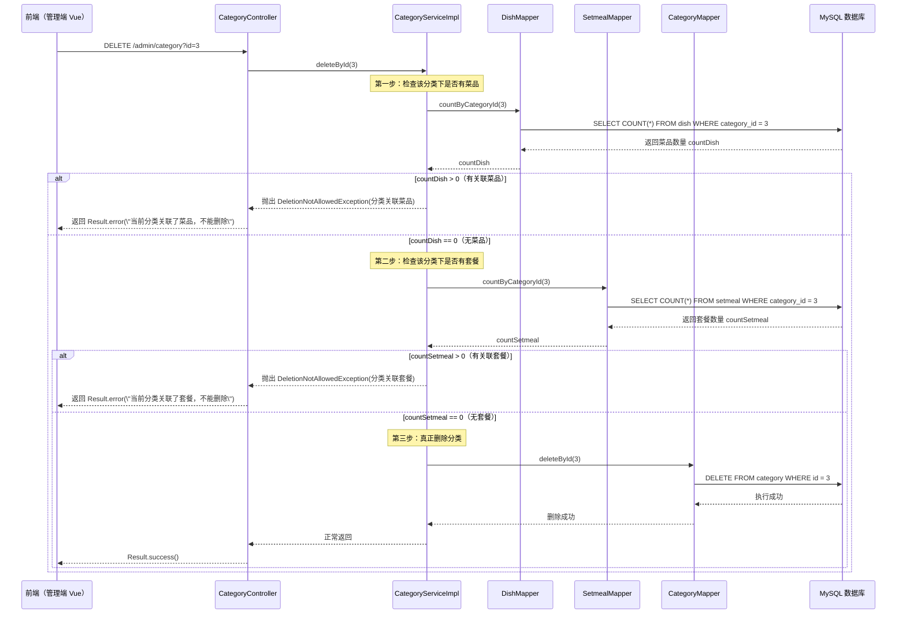

```
package com.sky.controller.admin;

import com.sky.dto.CategoryDTO;
import com.sky.dto.CategoryPageQueryDTO;
import com.sky.entity.Category;
import com.sky.result.PageResult;
import com.sky.result.Result;
import com.sky.service.CategoryService;
import io.swagger.annotations.Api;
import io.swagger.annotations.ApiOperation;
import lombok.extern.slf4j.Slf4j;
import org.springframework.beans.factory.annotation.Autowired;
import org.springframework.web.bind.annotation.*;
import java.util.List;

/**
 * 分类管理
 */
@RestController
@RequestMapping("/admin/category")
@Api(tags = "分类相关接口")
@Slf4j
public class CategoryController {

    @Autowired
    private CategoryService categoryService;

    /**
     * 新增分类
     * @param categoryDTO
     * @return
     */
    @PostMapping
    @ApiOperation("新增分类")
    public Result<String> save(@RequestBody CategoryDTO categoryDTO){
        log.info("新增分类：{}", categoryDTO);
        categoryService.save(categoryDTO);
        return Result.success();
    }

    /**
     * 分类分页查询
     * @param categoryPageQueryDTO
     * @return
     */
    @GetMapping("/page")
    @ApiOperation("分类分页查询")
    public Result<PageResult> page(CategoryPageQueryDTO categoryPageQueryDTO){
        log.info("分页查询：{}", categoryPageQueryDTO);
        PageResult pageResult = categoryService.pageQuery(categoryPageQueryDTO);
        return Result.success(pageResult);
    }

    /**
     * 删除分类
     * @param id
     * @return
     */
    @DeleteMapping
    @ApiOperation("删除分类")
    public Result<String> deleteById(Long id){
        log.info("删除分类：{}", id);
        categoryService.deleteById(id);
        return Result.success();
    }

    /**
     * 修改分类
     * @param categoryDTO
     * @return
     */
    @PutMapping
    @ApiOperation("修改分类")
    public Result<String> update(@RequestBody CategoryDTO categoryDTO){
        categoryService.update(categoryDTO);
        return Result.success();
    }

    /**
     * 启用、禁用分类
     * @param status
     * @param id
     * @return
     */
    @PostMapping("/status/{status}")
    @ApiOperation("启用禁用分类")
    public Result<String> startOrStop(@PathVariable("status") Integer status, Long id){
        categoryService.startOrStop(status,id);
        return Result.success();
    }

    /**
     * 根据类型查询分类
     * @param type
     * @return
     */
    @GetMapping("/list")
    @ApiOperation("根据类型查询分类")
    public Result<List<Category>> list(Integer type){
        List<Category> list = categoryService.list(type);
        return Result.success(list);
    }
}

```

很好 👍 这是一份 **分类管理后端接口的 Controller**。
我给你整理成一份 **可直接放到 GitHub README 的中文 Markdown 文档**：接口说明 + 功能解释 + 请求示例 + 设计要点。

---

# 🗂️ 分类管理接口（Admin 后台）

该控制器提供后台管理系统中的 **分类 CRUD 及启用禁用功能**。

| 模块        | 描述 |
| --------- | -- |
| 新增分类      | ✔  |
| 删除分类      | ✔  |
| 修改分类      | ✔  |
| 分页查询      | ✔  |
| 启用 / 禁用分类 | ✔  |
| 按类型查询分类   | ✔  |

---

## 📦 Controller 代码

```java
@RestController
@RequestMapping("/admin/category")
@Api(tags = "分类相关接口")
@Slf4j
public class CategoryController {

    @Autowired
    private CategoryService categoryService;

    @PostMapping
    @ApiOperation("新增分类")
    public Result<String> save(@RequestBody CategoryDTO categoryDTO){
        log.info("新增分类：{}", categoryDTO);
        categoryService.save(categoryDTO);
        return Result.success();
    }

    @GetMapping("/page")
    @ApiOperation("分类分页查询")
    public Result<PageResult> page(CategoryPageQueryDTO categoryPageQueryDTO){
        log.info("分页查询：{}", categoryPageQueryDTO);
        PageResult pageResult = categoryService.pageQuery(categoryPageQueryDTO);
        return Result.success(pageResult);
    }

    @DeleteMapping
    @ApiOperation("删除分类")
    public Result<String> deleteById(Long id){
        log.info("删除分类：{}", id);
        categoryService.deleteById(id);
        return Result.success();
    }

    @PutMapping
    @ApiOperation("修改分类")
    public Result<String> update(@RequestBody CategoryDTO categoryDTO){
        categoryService.update(categoryDTO);
        return Result.success();
    }

    @PostMapping("/status/{status}")
    @ApiOperation("启用禁用分类")
    public Result<String> startOrStop(@PathVariable("status") Integer status, Long id){
        categoryService.startOrStop(status,id);
        return Result.success();
    }

    @GetMapping("/list")
    @ApiOperation("根据类型查询分类")
    public Result<List<Category>> list(Integer type){
        List<Category> list = categoryService.list(type);
        return Result.success(list);
    }
}
```

---

## 🧭 接口总览

| 方法     | URL                               | 说明        |
| ------ | --------------------------------- | --------- |
| POST   | `/admin/category`                 | 新增分类      |
| GET    | `/admin/category/page`            | 分页查询分类    |
| DELETE | `/admin/category`                 | 删除分类      |
| PUT    | `/admin/category`                 | 修改分类      |
| POST   | `/admin/category/status/{status}` | 启用 / 禁用分类 |
| GET    | `/admin/category/list`            | 按类型查询分类   |

---

## ✨ 1. 新增分类

**POST**

```
/admin/category
```

**请求体示例（JSON）**

```json
{
  "name": "川菜",
  "sort": 1,
  "type": 1
}
```

**返回**

```json
{
  "code": 1,
  "msg": "success"
}
```

---

## 📄 2. 分类分页查询

**GET**

```
/admin/category/page
```

**请求参数**

| 参数       | 说明   |
| -------- | ---- |
| page     | 当前页  |
| pageSize | 每页条数 |
| name     | 模糊搜索 |
| type     | 分类类型 |

**示例**

```
/admin/category/page?page=1&pageSize=10&type=1
```

---

## 🗑️ 3. 删除分类

**DELETE**

```
/admin/category?id=5
```

> 一般要求：
> 👉 分类下有菜品 / 套餐则不能删除（在 service 校验）

---

## ✏️ 4. 修改分类

**PUT**

```
/admin/category
```

**请求体**

```json
{
  "id": 3,
  "name": "热销菜",
  "sort": 2
}
```

---

## 🚦 5. 启用 / 禁用分类

**POST**

```
/admin/category/status/{status}?id=3
```

| status | 含义 |
| ------ | -- |
| 0      | 禁用 |
| 1      | 启用 |

示例👇

```
/admin/category/status/0?id=3
```

---

## 🔍 6. 根据类型查询分类

**GET**

```
/admin/category/list?type=1
```

返回示例：

```json
[
  { "id": 1, "name": "川菜" },
  { "id": 2, "name": "粤菜" }
]
```

---

## 🧠 设计亮点（面试可讲）

* 分层清晰：Controller → Service → Mapper
* 统一返回 `Result<T>`
* 使用 DTO 隔离前端参数
* 支持分页查询 PageResult
* 日志可审计：`log.info`
* 支持启用禁用而不是直接删除
* RESTful 风格接口

---

## 🛡️ Swagger 支持

已使用：

```
@Api
@ApiOperation
```

👉 启动后访问：

```
/swagger-ui.html
```

即可接口调试。

---

## 🚀 可扩展优化（进阶）

可以继续加：

* 缓存分类列表（Redis）
* 分类排序调整接口
* 级联校验（分类 → 菜品）
* 多租户 shopId 隔离
* 乐观锁版本号
* 后台权限控制
* 防重复提交 Token

---

如果你愿意，我还能继续帮你：

🔹 Service 层实现
🔹 MyBatis Mapper SQL
🔹 Category 表设计（SQL DDL）
🔹 Redis 缓存 + 缓存一致性
🔹 分类下有菜品禁止删除（完整异常处理）


好，这次我们**真·逐行**把 `CategoryController` 啃一遍，你看完就能自己给别人讲了 👍

我先按「模块」拆开：

* 类和注解
* 成员变量
* 每个接口方法：入参 → 逻辑 → 返回

---

## 🧱 1. 类头部 & 注解

```java
package com.sky.controller.admin;
```

* 声明这个类所在的包：`com.sky.controller.admin`
* 一般 `controller.admin` 表示「后台管理端」的接口。

```java
import com.sky.dto.CategoryDTO;
import com.sky.dto.CategoryPageQueryDTO;
import com.sky.entity.Category;
import com.sky.result.PageResult;
import com.sky.result.Result;
import com.sky.service.CategoryService;
```

* 引入项目里用到的类：

  * `CategoryDTO`：新增/修改分类时用的请求参数对象
  * `CategoryPageQueryDTO`：分页查询时用的查询条件
  * `Category`：数据库里真正的分类实体
  * `PageResult`：统一的分页结果封装
  * `Result`：统一的接口返回包装
  * `CategoryService`：业务逻辑层

```java
import io.swagger.annotations.Api;
import io.swagger.annotations.ApiOperation;
import lombok.extern.slf4j.Slf4j;
import org.springframework.beans.factory.annotation.Autowired;
import org.springframework.web.bind.annotation.*;
import java.util.List;
```

* Swagger 注解：

  * `@Api`：给整个 Controller 标题/分组
  * `@ApiOperation`：给每个接口写说明（显示在 Swagger 文档里）
* `@Slf4j`：Lombok，自动生成一个 `log` 日志对象
* `@Autowired`：Spring 自动注入 Bean
* `org.springframework.web.bind.annotation.*`：REST 接口相关注解
* `List`：用来返回分类列表

---

## 🧱 2. 类定义 & 注解

```java
/**
 * 分类管理
 */
@RestController
@RequestMapping("/admin/category")
@Api(tags = "分类相关接口")
@Slf4j
public class CategoryController {
```

逐行拆：

* `/** ... */`

  * 类注释：说明这个类是「分类管理」

* `@RestController`

  * 等于：`@Controller + @ResponseBody`
  * 表示这是一个 REST 风格的控制器，方法返回的对象会直接转成 JSON 给前端

* `@RequestMapping("/admin/category")`

  * 给这个 Controller 下所有接口加一个统一前缀：`/admin/category`
  * 比如：`/page` → 实际路径是 `/admin/category/page`

* `@Api(tags = "分类相关接口")`

  * Swagger 文档里，这组接口显示为「分类相关接口」

* `@Slf4j`

  * 自动生成 `private static final Logger log = ...`
  * 方便使用 `log.info(...)` 打日志

* `public class CategoryController {`

  * 定义控制器类本身

---

## 🧱 3. 注入 Service

```java
    @Autowired
    private CategoryService categoryService;
```

* `@Autowired`

  * 告诉 Spring：请把已经注册好的 `CategoryService` 实现类注入进来
* `private CategoryService categoryService;`

  * 声明一个私有成员变量，Controller 通过它调用业务逻辑
  * Controller 自己不直接操作数据库，只调用 Service（分层思想）

---

## 🧩 4. 新增分类接口

```java
    /**
     * 新增分类
     * @param categoryDTO
     * @return
     */
    @PostMapping
    @ApiOperation("新增分类")
    public Result<String> save(@RequestBody CategoryDTO categoryDTO){
        log.info("新增分类：{}", categoryDTO);
        categoryService.save(categoryDTO);
        return Result.success();
    }
```

一行一行：

* Javadoc 注释：说明方法用途「新增分类」

* `@PostMapping`

  * 这个方法对应的 HTTP 请求是 `POST /admin/category`
  * 适合做「新增」动作

* `@ApiOperation("新增分类")`

  * Swagger 上显示接口名称「新增分类」

* `public Result<String> save(...){ ... }`

  * 方法名：`save`，语义明确：保存分类
  * 返回类型：`Result<String>`

    * 用统一的 `Result` 包起来
    * `<String>` 表示 data 类型是 `String`（这里实际上没返回具体内容，只是一个成功状态）

* `@RequestBody CategoryDTO categoryDTO`

  * 从请求体（JSON）里反序列化出一个 `CategoryDTO`
  * 前端传一个 JSON，例如：

    ```json
    { "name": "川菜", "sort": 1, "type": 1 }
    ```

* `log.info("新增分类：{}", categoryDTO);`

  * 日志记录：打印本次新增的分类参数
  * `{}` 是占位符，后面 `categoryDTO` 会自动转换成字符串

* `categoryService.save(categoryDTO);`

  * 调用 Service 层去执行真正的业务逻辑：

    * 校验名称是否重复
    * 设置创建时间/创建人
    * 调用 Mapper 插入数据库

* `return Result.success();`

  * 返回一个统一的成功结果
  * 一般是：

    ```json
    { "code": 1, "msg": "success", "data": null }
    ```

---

## 🧩 5. 分类分页查询接口

```java
    /**
     * 分类分页查询
     * @param categoryPageQueryDTO
     * @return
     */
    @GetMapping("/page")
    @ApiOperation("分类分页查询")
    public Result<PageResult> page(CategoryPageQueryDTO categoryPageQueryDTO){
        log.info("分页查询：{}", categoryPageQueryDTO);
        PageResult pageResult = categoryService.pageQuery(categoryPageQueryDTO);
        return Result.success(pageResult);
    }
```

* 注释：说明功能是「分类分页查询」

* `@GetMapping("/page")`

  * 路径：`GET /admin/category/page`
  * 用 GET 请求符合「查询」语义

* `@ApiOperation("分类分页查询")`

  * Swagger 显示接口名

* `public Result<PageResult> page(CategoryPageQueryDTO categoryPageQueryDTO)`

  * 不加 `@RequestBody`，说明参数来自 **URL 查询参数**，例如：

    * `/admin/category/page?page=1&pageSize=10&type=1`
  * Spring 会自动把这些 query 参数组装进 `CategoryPageQueryDTO`（通过同名字段）

* `log.info("分页查询：{}", categoryPageQueryDTO);`

  * 打印查询条件，方便排查分页问题

* `PageResult pageResult = categoryService.pageQuery(categoryPageQueryDTO);`

  * 调用 Service 查询分页数据
  * `PageResult` 一般包含：

    * `total`：总条数
    * `records`：数据列表

* `return Result.success(pageResult);`

  * 把分页结果封装到统一 `Result` 里返回前端

---

## 🧩 6. 删除分类接口

```java
    /**
     * 删除分类
     * @param id
     * @return
     */
    @DeleteMapping
    @ApiOperation("删除分类")
    public Result<String> deleteById(Long id){
        log.info("删除分类：{}", id);
        categoryService.deleteById(id);
        return Result.success();
    }
```

* 注释：功能是「删除分类」

* `@DeleteMapping`

  * HTTP 方法：`DELETE /admin/category`
  * 符合 REST 风格：删除用 DELETE

* `public Result<String> deleteById(Long id)`

  * 参数 `id` 没有注解，默认从：

    * Query 参数里拿：`/admin/category?id=3`

* `log.info("删除分类：{}", id);`

  * 打日志：记录删除的是哪个分类

* `categoryService.deleteById(id);`

  * 交给 Service：

    * 一般会先判断：该分类下是否还有菜品/套餐，如果有可能抛自定义异常

* `return Result.success();`

  * 删除成功 → 返回通用 OK 响应

---

## 🧩 7. 修改分类接口

```java
    /**
     * 修改分类
     * @param categoryDTO
     * @return
     */
    @PutMapping
    @ApiOperation("修改分类")
    public Result<String> update(@RequestBody CategoryDTO categoryDTO){
        categoryService.update(categoryDTO);
        return Result.success();
    }
```

* 注释：用于「修改分类」

* `@PutMapping`

  * HTTP 方法：`PUT /admin/category`
  * 在 REST 语义里，「修改」通常用 PUT

* `public Result<String> update(@RequestBody CategoryDTO categoryDTO)`

  * 从请求体 JSON 里拿参数，反序列化为 `CategoryDTO`
  * DTO 里应包含 `id` + 要修改的字段（比如 name、sort、type）

* `categoryService.update(categoryDTO);`

  * 调用业务层更新：

    * 可能会校验是否重名
    * 修改更新时间/更新人

* `return Result.success();`

  * 返回统一成功结果

---

## 🧩 8. 启用 / 禁用分类接口

```java
    /**
     * 启用、禁用分类
     * @param status
     * @param id
     * @return
     */
    @PostMapping("/status/{status}")
    @ApiOperation("启用禁用分类")
    public Result<String> startOrStop(@PathVariable("status") Integer status, Long id){
        categoryService.startOrStop(status,id);
        return Result.success();
    }
```

* 注释：启用 / 禁用某个分类

* `@PostMapping("/status/{status}")`

  * 请求方式：POST
  * 路径：`/admin/category/status/{status}`
  * `{status}` 是路径里的动态参数，比如：

    * `/admin/category/status/1?id=3` → 启用 id=3
    * `/admin/category/status/0?id=3` → 禁用 id=3

* `@ApiOperation("启用禁用分类")`

  * Swagger 标题

* `public Result<String> startOrStop(@PathVariable("status") Integer status, Long id)`

  * `@PathVariable("status") Integer status`

    * 从 URL 路径中取出 `{status}`，绑定到方法参数 `status` 上
  * `Long id`

    * 从 query 参数里拿，比如 `?id=3`
  * 最终组合：修改某个 id 的状态

* `categoryService.startOrStop(status,id);`

  * 交给 Service：

    * status = 1 → 启用
    * status = 0 → 禁用
    * 可能会顺便校验是否允许禁用（例如分类下有正在售卖商品）

* `return Result.success();`

  * 操作成功 → 返回统一 OK

---

## 🧩 9. 根据类型查询分类接口

```java
    /**
     * 根据类型查询分类
     * @param type
     * @return
     */
    @GetMapping("/list")
    @ApiOperation("根据类型查询分类")
    public Result<List<Category>> list(Integer type){
        List<Category> list = categoryService.list(type);
        return Result.success(list);
    }
}
```

* 注释：根据分类类型查询

* `@GetMapping("/list")`

  * 路径：`GET /admin/category/list`

* `public Result<List<Category>> list(Integer type)`

  * 参数 `type` 从 query 参数获取：`/admin/category/list?type=1`
  * 返回类型：`Result<List<Category>>`

    * data 是一个 Category 实体的列表

* `List<Category> list = categoryService.list(type);`

  * 调用 Service 按类型查出所有分类
  * 一般用于前端下拉框：比如「菜品分类下拉列表」

* `return Result.success(list);`

  * 把查到的分类列表作为 data 返回

---

## 🧠 整体架构小结（你可以在面试里这样说）

* **Controller 职责**：

  * 只负责：接收参数、简单日志、调用 Service、封装返回
  * **不直接**写业务逻辑（如校验是否有菜品、事务等）

* **统一返回格式**：

  * 通过 `Result<T>` 统一 JSON 结构
  * 方便前端统一处理 code/msg

* **参数规范**：

  * 新增/修改用 DTO（`@RequestBody` + JSON）
  * 查询/删除/状态切换用 Query 参数 或 PathVariable

* **接口风格**：

  * `POST` → 新增
  * `GET` → 查询/分页
  * `PUT` → 修改
  * `DELETE` → 删除
  * `POST /status/{status}` → 做状态切换，避免和普通更新混在一起

---

如果你愿意，下一步我可以帮你：

- 1️⃣ 逐行解释 `CategoryService` 实现（包含「有菜品不能删」那种业务逻辑）
- 2️⃣ 把这段 Controller 改成 **带校验注解** 的版本（`@Valid`、`@NotBlank` 等）
- 3️⃣ 画一张「前端请求 → Controller → Service → Mapper → DB」时序图（用文字或 mermaid）

好，这三个我给你一次性全搞定，全部按 **苍穹外卖** 的写法来讲。

---

## 1️⃣ CategoryService & CategoryServiceImpl 逐行解释（含「有菜品/套餐不能删」）

先给出 **接口 + 实现类完整代码**（接近苍穹原版），然后逐段讲。

### 1.1 CategoryService 接口

```java
package com.sky.service;

import com.sky.dto.CategoryDTO;
import com.sky.dto.CategoryPageQueryDTO;
import com.sky.entity.Category;
import com.sky.result.PageResult;

import java.util.List;

public interface CategoryService {

    /**
     * 新增分类
     */
    void save(CategoryDTO categoryDTO);

    /**
     * 分类分页查询
     */
    PageResult pageQuery(CategoryPageQueryDTO categoryPageQueryDTO);

    /**
     * 根据id删除分类
     */
    void deleteById(Long id);

    /**
     * 修改分类
     */
    void update(CategoryDTO categoryDTO);

    /**
     * 启用、禁用分类
     */
    void startOrStop(Integer status, Long id);

    /**
     * 根据类型查询分类
     */
    List<Category> list(Integer type);
}
```

**解释：**

* 这是 Service 层接口，只定义「要做什么」，不写具体实现。
* 对应你 Controller 里的所有方法：

  * `save` → 新增分类
  * `pageQuery` → 分页查询
  * `deleteById` → 删除分类（带业务校验）
  * `update` → 修改分类
  * `startOrStop` → 启用 / 禁用
  * `list` → 根据类型查询

---

### 1.2 CategoryServiceImpl 实现类（苍穹外卖风格）

```java
package com.sky.service.impl;

import com.github.pagehelper.Page;
import com.github.pagehelper.PageHelper;
import com.sky.constant.MessageConstant;
import com.sky.constant.StatusConstant;
import com.sky.context.BaseContext;
import com.sky.dto.CategoryDTO;
import com.sky.dto.CategoryPageQueryDTO;
import com.sky.entity.Category;
import com.sky.exception.DeletionNotAllowedException;
import com.sky.mapper.CategoryMapper;
import com.sky.mapper.DishMapper;
import com.sky.mapper.SetmealMapper;
import com.sky.result.PageResult;
import com.sky.service.CategoryService;
import org.springframework.beans.BeanUtils;
import org.springframework.beans.factory.annotation.Autowired;
import org.springframework.stereotype.Service;

import java.time.LocalDateTime;
import java.util.List;

@Service
public class CategoryServiceImpl implements CategoryService {

    @Autowired
    private CategoryMapper categoryMapper;

    @Autowired
    private DishMapper dishMapper;

    @Autowired
    private SetmealMapper setmealMapper;

    /**
     * 新增分类
     */
    @Override
    public void save(CategoryDTO categoryDTO) {
        Category category = new Category();
        // DTO -> Entity 属性拷贝
        BeanUtils.copyProperties(categoryDTO, category);

        // 新增时默认禁用，等运营手动启用
        category.setStatus(StatusConstant.DISABLE);

        // 审计字段
        LocalDateTime now = LocalDateTime.now();
        category.setCreateTime(now);
        category.setUpdateTime(now);

        Long currentUserId = BaseContext.getCurrentId();
        category.setCreateUser(currentUserId);
        category.setUpdateUser(currentUserId);

        // 调用 Mapper 插入数据库
        categoryMapper.insert(category);
    }

    /**
     * 分类分页查询
     */
    @Override
    public PageResult pageQuery(CategoryPageQueryDTO categoryPageQueryDTO) {
        // 1. 设置分页参数（PageHelper 会拦截后续的 SQL）
        PageHelper.startPage(categoryPageQueryDTO.getPage(), categoryPageQueryDTO.getPageSize());

        // 2. 执行 Mapper 的分页查询（返回 Page 对象）
        Page<Category> page = categoryMapper.pageQuery(categoryPageQueryDTO);

        // 3. 组装为通用的 PageResult
        long total = page.getTotal();
        List<Category> records = page.getResult();

        return new PageResult(total, records);
    }

    /**
     * 根据id删除分类（有菜品/套餐不能删）
     */
    @Override
    public void deleteById(Long id) {
        // 1. 先查该分类下是否有菜品
        Integer count = dishMapper.countByCategoryId(id);
        if (count != null && count > 0) {
            // 有菜品，不能删，抛业务异常
            throw new DeletionNotAllowedException(MessageConstant.CATEGORY_BE_RELATED_BY_DISH);
        }

        // 2. 再查该分类下是否有套餐
        count = setmealMapper.countByCategoryId(id);
        if (count != null && count > 0) {
            // 有套餐，不能删
            throw new DeletionNotAllowedException(MessageConstant.CATEGORY_BE_RELATED_BY_SETMEAL);
        }

        // 3. 都没有关联，才真正删除
        categoryMapper.deleteById(id);
    }

    /**
     * 修改分类
     */
    @Override
    public void update(CategoryDTO categoryDTO) {
        Category category = new Category();
        BeanUtils.copyProperties(categoryDTO, category);

        // 只更新修改时间和修改人
        category.setUpdateTime(LocalDateTime.now());
        category.setUpdateUser(BaseContext.getCurrentId());

        categoryMapper.update(category);
    }

    /**
     * 启用、禁用分类
     */
    @Override
    public void startOrStop(Integer status, Long id) {
        Category category = Category.builder()
                .id(id)
                .status(status)
                .updateTime(LocalDateTime.now())
                .updateUser(BaseContext.getCurrentId())
                .build();

        categoryMapper.update(category);
    }

    /**
     * 根据类型查询分类
     */
    @Override
    public List<Category> list(Integer type) {
        return categoryMapper.list(type);
    }
}
```

`deleteById` 逻辑与苍穹外卖官方教程一致：先查菜品，再查套餐，有就抛业务异常，没有才删。([CSDN Blog][1])

---

### 1.3 逐段解释重点（尤其删除逻辑）

#### （1）类和成员

```java
@Service
public class CategoryServiceImpl implements CategoryService {
```

* `@Service`：声明这是 Service 层 Bean，交给 Spring 管理。
* `implements CategoryService`：实现刚才那个接口。

```java
    @Autowired
    private CategoryMapper categoryMapper;

    @Autowired
    private DishMapper dishMapper;

    @Autowired
    private SetmealMapper setmealMapper;
```

* 在苍穹外卖里，**分类删除要查两张表**：

  * `dish` 表（菜品）
  * `setmeal` 表（套餐）
* 所以这里注入三个 Mapper，负责操作三张表：

---

#### （2）save：新增分类

```java
public void save(CategoryDTO categoryDTO) {
    Category category = new Category();
    BeanUtils.copyProperties(categoryDTO, category);
```

* 创建实体对象 `Category`
* 用 `BeanUtils.copyProperties` 把 DTO 中的相同字段拷贝进去（减少 setter）

```java
    category.setStatus(StatusConstant.DISABLE);
```

* 新增分类默认**禁用状态**（运营手动启用）
* `StatusConstant.DISABLE` 一般是 0

```java
    LocalDateTime now = LocalDateTime.now();
    category.setCreateTime(now);
    category.setUpdateTime(now);
```

* 记录创建时间 & 修改时间（刚新增，所以相同）

```java
    Long currentUserId = BaseContext.getCurrentId();
    category.setCreateUser(currentUserId);
    category.setUpdateUser(currentUserId);
```

* 从 `BaseContext`（ThreadLocal）获取当前登录员工 id
* 写入创建人 / 修改人（审计字段）

```java
    categoryMapper.insert(category);
}
```

* 调用 Mapper，插入数据库 `category` 表

---

#### （3）pageQuery：分页查询

```java
PageHelper.startPage(categoryPageQueryDTO.getPage(), categoryPageQueryDTO.getPageSize());
Page<Category> page = categoryMapper.pageQuery(categoryPageQueryDTO);
```

* 用 PageHelper 这个插件：

  * `startPage` 会对后面的 SQL 做拦截，自动加 `limit` 等分页语句
* `categoryMapper.pageQuery(dto)` 实际执行一条 SELECT，返回 Page 对象

```java
long total = page.getTotal();
List<Category> records = page.getResult();
return new PageResult(total, records);
```

* 从 Page 里拿出：

  * `total` 总条数
  * `result` 当前页数据
* 封装到统一的 `PageResult`，Controller 再返回 `Result<PageResult>`

---

#### （4）deleteById：有菜品/套餐不能删（重点）

```java
public void deleteById(Long id) {
    // 1. 先查该分类下是否有菜品
    Integer count = dishMapper.countByCategoryId(id);
    if (count != null && count > 0) {
        // 有菜品，不能删，抛业务异常
        throw new DeletionNotAllowedException(MessageConstant.CATEGORY_BE_RELATED_BY_DISH);
    }
```

**逻辑解释：**

* 先查 `dish` 表中 `category_id = id` 的数量：

  * Mapper 中 SQL 大概是：
    `SELECT COUNT(*) FROM dish WHERE category_id = #{id}`
* 如果 `count > 0`，说明这个分类底下有菜品：

  * 直接抛出 `DeletionNotAllowedException`
  * `MessageConstant.CATEGORY_BE_RELATED_BY_DISH` 一般是 `"当前分类关联了菜品，不能删除"`
* 抛异常后，后面代码不会执行，Spring 全局异常处理会把它转换成统一的错误响应（比如 code=0, msg="当前分类关联了菜品，不能删除"）

```java
    // 2. 再查该分类下是否有套餐
    count = setmealMapper.countByCategoryId(id);
    if (count != null && count > 0) {
        // 有套餐，不能删
        throw new DeletionNotAllowedException(MessageConstant.CATEGORY_BE_RELATED_BY_SETMEAL);
    }
```

* 如果分类没关联菜品，再查套餐表 `setmeal`：

  * SQL 类似：
    `SELECT COUNT(*) FROM setmeal WHERE category_id = #{id}`
* 有套餐同样抛异常，提示「当前分类关联了套餐，不能删除」

```java
    // 3. 都没有关联，才真正删除
    categoryMapper.deleteById(id);
}
```

* 「除了上面两种情况」，说明：

  * 分类没有关联菜品
  * 分类没有关联套餐
* 才执行真正删除：

  * SQL：`DELETE FROM category WHERE id = #{id}`

**为什么要这样设计？（面试可以说）**

* 保护数据完整性：
  防止删了分类，菜品/套餐还在，但指向一个不存在的分类。
* 符合真实业务：
  一个「川菜」分类下面有很多菜，不可能让运营一键删掉分类导致前台挂掉。
* 通过业务异常 + 全局异常处理，把「不能删」做成用户友好的提示：
  而不是 500 服务器错误。

---

#### （5）update：修改分类

```java
public void update(CategoryDTO categoryDTO) {
    Category category = new Category();
    BeanUtils.copyProperties(categoryDTO, category);

    category.setUpdateTime(LocalDateTime.now());
    category.setUpdateUser(BaseContext.getCurrentId());

    categoryMapper.update(category);
}
```

* DTO → Entity 拷贝
* 更新修改时间和修改人
* 调用 `categoryMapper.update` 执行 `UPDATE category SET ... WHERE id = ?`

---

#### （6）startOrStop：启用/禁用

```java
public void startOrStop(Integer status, Long id) {
    Category category = Category.builder()
            .id(id)
            .status(status)
            .updateTime(LocalDateTime.now())
            .updateUser(BaseContext.getCurrentId())
            .build();

    categoryMapper.update(category);
}
```

* 只构建了部分字段：id / status / updateTime / updateUser
* 这种写法在 MyBatis 中一般是动态 SQL：只更新非空字段
* 用于「上架 / 下架某分类」

---

#### （7）list：根据类型查询

```java
public List<Category> list(Integer type) {
    return categoryMapper.list(type);
}
```

* 根据 `type` 查分类：
  比如：

  * 1 = 菜品分类
  * 2 = 套餐分类
* 前端：新增菜品页面、套餐页面，下拉框用的就是这个接口。

---

## 2️⃣ 带校验注解的 Controller 改造版（@Valid, @Validated）

你原来的 `CategoryController` 已经很标准了，我们只在上面「加上参数校验」。

### 2.1 先假设 CategoryDTO 上已经加了字段校验（推荐）

**CategoryDTO 示例（参考）**

```java
package com.sky.dto;

import lombok.Data;

import javax.validation.constraints.Min;
import javax.validation.constraints.NotBlank;
import javax.validation.constraints.NotNull;

@Data
public class CategoryDTO {

    private Long id;

    @NotBlank(message = "分类名称不能为空")
    private String name;

    @NotNull(message = "分类类型不能为空")
    private Integer type;

    @NotNull(message = "排序值不能为空")
    @Min(value = 0, message = "排序值不能为负数")
    private Integer sort;
}
```

这样，Controller 只要加上 `@Valid`，就能对请求体做校验。

---

### 2.2 加上校验注解后的 CategoryController

```java
package com.sky.controller.admin;

import com.sky.dto.CategoryDTO;
import com.sky.dto.CategoryPageQueryDTO;
import com.sky.entity.Category;
import com.sky.result.PageResult;
import com.sky.result.Result;
import com.sky.service.CategoryService;
import io.swagger.annotations.Api;
import io.swagger.annotations.ApiOperation;
import lombok.extern.slf4j.Slf4j;
import org.springframework.beans.factory.annotation.Autowired;
import org.springframework.validation.annotation.Validated;
import org.springframework.web.bind.annotation.*;

import javax.validation.Valid;
import javax.validation.constraints.NotNull;
import java.util.List;

/**
 * 分类管理
 */
@RestController
@RequestMapping("/admin/category")
@Api(tags = "分类相关接口")
@Slf4j
@Validated // 开启对方法参数（如 @NotNull）的校验
public class CategoryController {

    @Autowired
    private CategoryService categoryService;

    /**
     * 新增分类
     */
    @PostMapping
    @ApiOperation("新增分类")
    public Result<String> save(@Valid @RequestBody CategoryDTO categoryDTO) {
        log.info("新增分类：{}", categoryDTO);
        categoryService.save(categoryDTO);
        return Result.success();
    }

    /**
     * 分类分页查询
     */
    @GetMapping("/page")
    @ApiOperation("分类分页查询")
    public Result<PageResult> page(@Valid CategoryPageQueryDTO categoryPageQueryDTO) {
        log.info("分页查询：{}", categoryPageQueryDTO);
        PageResult pageResult = categoryService.pageQuery(categoryPageQueryDTO);
        return Result.success(pageResult);
    }

    /**
     * 删除分类
     */
    @DeleteMapping
    @ApiOperation("删除分类")
    public Result<String> deleteById(@NotNull(message = "分类id不能为空")
                                     @RequestParam Long id) {
        log.info("删除分类：{}", id);
        categoryService.deleteById(id);
        return Result.success();
    }

    /**
     * 修改分类
     */
    @PutMapping
    @ApiOperation("修改分类")
    public Result<String> update(@Valid @RequestBody CategoryDTO categoryDTO) {
        log.info("修改分类：{}", categoryDTO);
        categoryService.update(categoryDTO);
        return Result.success();
    }

    /**
     * 启用、禁用分类
     */
    @PostMapping("/status/{status}")
    @ApiOperation("启用禁用分类")
    public Result<String> startOrStop(@PathVariable("status")
                                      @NotNull(message = "状态不能为空") Integer status,
                                      @NotNull(message = "分类id不能为空")
                                      @RequestParam Long id) {
        log.info("修改分类状态，id={}，status={}", id, status);
        categoryService.startOrStop(status, id);
        return Result.success();
    }

    /**
     * 根据类型查询分类
     */
    @GetMapping("/list")
    @ApiOperation("根据类型查询分类")
    public Result<List<Category>> list(@RequestParam(required = false) Integer type) {
        List<Category> list = categoryService.list(type);
        return Result.success(list);
    }
}
```

**关键点解释：**

* `@Validated`：
  加在类上，开启对「方法参数注解」的校验，比如 `@NotNull`。
* `@Valid @RequestBody CategoryDTO`：
  对请求体里的 JSON 进行 Bean 校验（用 DTO 上的注解）。
* `@NotNull + @RequestParam`：
  确保 `id` 这种关键参数不能缺失。
* 校验失败会抛出 `MethodArgumentNotValidException` 或 `ConstraintViolationException`，
  苍穹项目里一般会在全局异常处理里统一转成前端友好的错误 JSON。

---

## 3️⃣「前端 → Controller → Service → Mapper → DB」流程图（苍穹删除分类为例）

用 **Mermaid 时序图** 描述「删除分类」的完整链路，你可以直接放 README 或笔记中渲染。

> 例子：前端点击「删除分类」，后端要检查「是否有关联菜品/套餐」，再决定是否可以删。



**怎么讲这个图（面试视角）：**

* 前端只发一个删除请求：`DELETE /admin/category?id=3`
* Controller 不写业务逻辑，只调用 `categoryService.deleteById`
* Service 里先后调用两个 Mapper：

  * `DishMapper.countByCategoryId` → 查菜品数量
  * `SetmealMapper.countByCategoryId` → 查套餐数量
* 只要有一种关联数据，就抛业务异常 → 被全局异常处理成统一错误 JSON 返回。
* 没有关联时，才调用 `CategoryMapper.deleteById` 执行真正的 DELETE。

---

如果你愿意，下一步我可以帮你：

* 把 **CategoryMapper / DishMapper / SetmealMapper 的方法 + SQL** 也写出来并逐行讲
* 或者按苍穹风格，给你做一整套「分类管理模块」的 **README 大纲**（Controller + Service + Mapper + SQL + 接口文档）。

[1]: https://blog.csdn.net/qq_62006367/article/details/132657800?utm_source=chatgpt.com "项目实战——苍穹外卖(Day2) 原创"

好，你是想要一种**不用 Mermaid、画图工具也能直接展示的版本**，比如可以在：

* 记事本
* 微信
* 控制台
* Markdown 普通文本

里直接粘贴就能看的那种 ✔️

我给你三种选择（任选复制）：

---

# ✅ 方案一：ASCII 文本流程图（推荐，最通用）

```
┌───────────────────────────────┐
│  前端：点击“删除分类”按钮        │
└───────────────┬───────────────┘
                │ 发送请求
                ▼
        DELETE /admin/category?id=3
                │
                ▼
┌───────────────────────────────┐
│  CategoryController.deleteById │
└───────────────┬───────────────┘
                │ 调用
                ▼
┌───────────────────────────────┐
│      CategoryServiceImpl       │
└───────────────┬───────────────┘
                │
                │ 第一步：检查是否有关联菜品
                ▼
┌───────────────────────────────┐
│      DishMapper.count(...)     │
└───────────────┬───────────────┘
                │
                ▼
          SELECT COUNT(*) 
            FROM dish 
         WHERE category_id = 3

                │
        ┌───────┴──────────────────────┐
        │ count > 0 ?                   │
        └───────────────┬──────────────┘
                        │是
                        ▼
             ❌ 抛异常：分类被菜品关联
             ❌ 不能删除
             ❌ 返回错误信息
                        │
                        └── 结束

                        │否
                        ▼
第二步：检查是否有关联套餐

┌───────────────────────────────┐
│    SetmealMapper.count(...)   │
└───────────────┬───────────────┘
                │
                ▼
          SELECT COUNT(*) 
           FROM setmeal 
        WHERE category_id = 3

                │
        ┌───────┴──────────────────────┐
        │ count > 0 ?                   │
        └───────────────┬──────────────┘
                        │是
                        ▼
             ❌ 抛异常：分类被套餐关联
             ❌ 不能删除
             ❌ 返回错误信息
                        │
                        └── 结束

                        │否
                        ▼
第三步：真正执行删除

┌───────────────────────────────┐
│    CategoryMapper.deleteById   │
└───────────────┬───────────────┘
                │
                ▼
      DELETE FROM category 
        WHERE id = 3

                │
                ▼
           ✔ 删除成功
           ✔ 返回 Result.success()
```

---

# ✅ 方案二：极简步骤版（适合文档 / 面试口述）

```
前端发起请求：
    DELETE /admin/category?id=3

Controller：
    调用 categoryService.deleteById(3)

Service 执行三步：

1）检查是否有关联菜品
    SELECT COUNT(*) FROM dish WHERE category_id = 3
    如果 count > 0
        抛异常：分类被菜品关联，不能删除

2）检查是否有关联套餐
    SELECT COUNT(*) FROM setmeal WHERE category_id = 3
    如果 count > 0
        抛异常：分类被套餐关联，不能删除

3）执行删除
    DELETE FROM category WHERE id = 3

返回：
    删除成功 → Result.success()
    失败 → Result.error("当前分类关联了菜品/套餐，不能删除")
```

---

# ✅ 方案三：表格版（适合 README.md）

| 阶段          | 行为                          | 说明         |
| ----------- | --------------------------- | ---------- |
| 前端          | 点击删除按钮                      | 传入分类 id    |
| HTTP        | DELETE /admin/category?id=3 | Restful 风格 |
| Controller  | 调用 service.deleteById       | 不写业务       |
| Service 第一步 | 查 dish 表                    | 分类是否关联菜品   |
| 判断1         | count > 0                   | 抛异常，不能删    |
| Service 第二步 | 查 setmeal 表                 | 分类是否关联套餐   |
| 判断2         | count > 0                   | 抛异常，不能删    |
| Service 第三步 | deleteById                  | 真正删除       |
| Mapper      | 执行 SQL                      | 作用数据库      |
| 返回          | Result.success()            | 删除成功       |

---

👉 你可以告诉我：

* 要不要我帮你**把这些整理成完整 GitHub README 模块**
* 或者要不要继续：

  * ✔ DishMapper / SetmealMapper SQL
  * ✔ MyBatis XML 写法
  * ✔ GlobalExceptionHandler 捕获业务异常
  * ✔ 前端删除按钮 + 弹窗确认 + 提示信息
