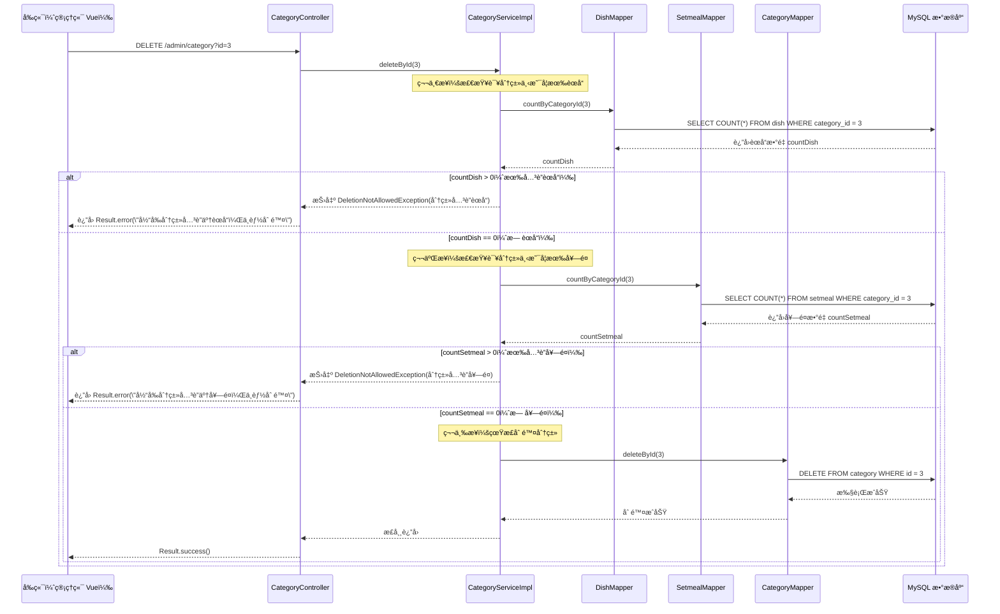

```
package com.sky.controller.admin;

import com.sky.dto.CategoryDTO;
import com.sky.dto.CategoryPageQueryDTO;
import com.sky.entity.Category;
import com.sky.result.PageResult;
import com.sky.result.Result;
import com.sky.service.CategoryService;
import io.swagger.annotations.Api;
import io.swagger.annotations.ApiOperation;
import lombok.extern.slf4j.Slf4j;
import org.springframework.beans.factory.annotation.Autowired;
import org.springframework.web.bind.annotation.*;
import java.util.List;

/**
 * 分类管ç†
 */
@RestController
@RequestMapping("/admin/category")
@Api(tags = "分类相关æ¥å£")
@Slf4j
public class CategoryController {

    @Autowired
    private CategoryService categoryService;

    /**
     * æ–°å¢åˆ†ç±»
     * @param categoryDTO
     * @return
     */
    @PostMapping
    @ApiOperation("æ–°å¢åˆ†ç±»")
    public Result<String> save(@RequestBody CategoryDTO categoryDTO){
        log.info("æ–°å¢åˆ†ç±»ï¼š{}", categoryDTO);
        categoryService.save(categoryDTO);
        return Result.success();
    }

    /**
     * 分类分页查询
     * @param categoryPageQueryDTO
     * @return
     */
    @GetMapping("/page")
    @ApiOperation("分类分页查询")
    public Result<PageResult> page(CategoryPageQueryDTO categoryPageQueryDTO){
        log.info("分页查询：{}", categoryPageQueryDTO);
        PageResult pageResult = categoryService.pageQuery(categoryPageQueryDTO);
        return Result.success(pageResult);
    }

    /**
     * 删除分类
     * @param id
     * @return
     */
    @DeleteMapping
    @ApiOperation("删除分类")
    public Result<String> deleteById(Long id){
        log.info("删除分类：{}", id);
        categoryService.deleteById(id);
        return Result.success();
    }

    /**
     * 修改分类
     * @param categoryDTO
     * @return
     */
    @PutMapping
    @ApiOperation("修改分类")
    public Result<String> update(@RequestBody CategoryDTO categoryDTO){
        categoryService.update(categoryDTO);
        return Result.success();
    }

    /**
     * å¯ç”¨ã€ç¦ç”¨åˆ†ç±»
     * @param status
     * @param id
     * @return
     */
    @PostMapping("/status/{status}")
    @ApiOperation("å¯ç”¨ç¦ç”¨åˆ†ç±»")
    public Result<String> startOrStop(@PathVariable("status") Integer status, Long id){
        categoryService.startOrStop(status,id);
        return Result.success();
    }

    /**
     * æ ¹æ®ç±»å‹æŸ¥è¯¢åˆ†ç±»
     * @param type
     * @return
     */
    @GetMapping("/list")
    @ApiOperation("æ ¹æ®ç±»å‹æŸ¥è¯¢åˆ†ç±»")
    public Result<List<Category>> list(Integer type){
        List<Category> list = categoryService.list(type);
        return Result.success(list);
    }
}

```

很好 👠这是一份 **分类管ç†å端æ¥å£çš„ Controller**。
我给你整ç†æˆä¸€ä»½ **å¯ç›´æ¥æ”¾åˆ° GitHub README 的中文 Markdown 文档**：æ¥å£è¯´æ˜ + 功能解释 + 请求示例 + 设计è¦ç‚¹ã€‚

---

# ğŸ—‚ï¸ åˆ†ç±»ç®¡ç†æ¥å£ï¼ˆAdmin åå°ï¼‰

该æ§åˆ¶å™¨æä¾›åå°ç®¡ç†ç³»ç»Ÿä¸­çš„ **分类 CRUD åŠå¯ç”¨ç¦ç”¨åŠŸèƒ½**。

| æ¨¡å—        | æè¿° |
| --------- | -- |
| æ–°å¢åˆ†ç±»      | ✔  |
| 删除分类      | ✔  |
| 修改分类      | ✔  |
| 分页查询      | ✔  |
| å¯ç”¨ / ç¦ç”¨åˆ†ç±» | ✔  |
| 按类å‹æŸ¥è¯¢åˆ†ç±»   | ✔  |

---

## 📦 Controller 代ç 

```java
@RestController
@RequestMapping("/admin/category")
@Api(tags = "分类相关æ¥å£")
@Slf4j
public class CategoryController {

    @Autowired
    private CategoryService categoryService;

    @PostMapping
    @ApiOperation("æ–°å¢åˆ†ç±»")
    public Result<String> save(@RequestBody CategoryDTO categoryDTO){
        log.info("æ–°å¢åˆ†ç±»ï¼š{}", categoryDTO);
        categoryService.save(categoryDTO);
        return Result.success();
    }

    @GetMapping("/page")
    @ApiOperation("分类分页查询")
    public Result<PageResult> page(CategoryPageQueryDTO categoryPageQueryDTO){
        log.info("分页查询：{}", categoryPageQueryDTO);
        PageResult pageResult = categoryService.pageQuery(categoryPageQueryDTO);
        return Result.success(pageResult);
    }

    @DeleteMapping
    @ApiOperation("删除分类")
    public Result<String> deleteById(Long id){
        log.info("删除分类：{}", id);
        categoryService.deleteById(id);
        return Result.success();
    }

    @PutMapping
    @ApiOperation("修改分类")
    public Result<String> update(@RequestBody CategoryDTO categoryDTO){
        categoryService.update(categoryDTO);
        return Result.success();
    }

    @PostMapping("/status/{status}")
    @ApiOperation("å¯ç”¨ç¦ç”¨åˆ†ç±»")
    public Result<String> startOrStop(@PathVariable("status") Integer status, Long id){
        categoryService.startOrStop(status,id);
        return Result.success();
    }

    @GetMapping("/list")
    @ApiOperation("æ ¹æ®ç±»å‹æŸ¥è¯¢åˆ†ç±»")
    public Result<List<Category>> list(Integer type){
        List<Category> list = categoryService.list(type);
        return Result.success(list);
    }
}
```

---

## 🧭 æ¥å£æ€»è§ˆ

| 方法     | URL                               | è¯´æ˜        |
| ------ | --------------------------------- | --------- |
| POST   | `/admin/category`                 | æ–°å¢åˆ†ç±»      |
| GET    | `/admin/category/page`            | 分页查询分类    |
| DELETE | `/admin/category`                 | 删除分类      |
| PUT    | `/admin/category`                 | 修改分类      |
| POST   | `/admin/category/status/{status}` | å¯ç”¨ / ç¦ç”¨åˆ†ç±» |
| GET    | `/admin/category/list`            | 按类å‹æŸ¥è¯¢åˆ†ç±»   |

---

## ✨ 1. æ–°å¢åˆ†ç±»

**POST**

```
/admin/category
```

**请求体示例（JSON）**

```json
{
  "name": "å·èœ",
  "sort": 1,
  "type": 1
}
```

**è¿”å›**

```json
{
  "code": 1,
  "msg": "success"
}
```

---

## 📄 2. 分类分页查询

**GET**

```
/admin/category/page
```

**请求å‚æ•°**

| å‚æ•°       | è¯´æ˜   |
| -------- | ---- |
| page     | 当å‰é¡µ  |
| pageSize | æ¯é¡µæ¡æ•° |
| name     | 模糊æœç´¢ |
| type     | åˆ†ç±»ç±»å‹ |

**示例**

```
/admin/category/page?page=1&pageSize=10&type=1
```

---

## ğŸ—‘ï¸ 3. 删除分类

**DELETE**

```
/admin/category?id=5
```

> 一般è¦æ±‚：
> 👉 分类下有èœå“ / 套é¤åˆ™ä¸èƒ½åˆ é™¤ï¼ˆåœ¨ service 校验）

---

## âœï¸ 4. 修改分类

**PUT**

```
/admin/category
```

**请求体**

```json
{
  "id": 3,
  "name": "热销èœ",
  "sort": 2
}
```

---

## 🚦 5. å¯ç”¨ / ç¦ç”¨åˆ†ç±»

**POST**

```
/admin/category/status/{status}?id=3
```

| status | å«ä¹‰ |
| ------ | -- |
| 0      | ç¦ç”¨ |
| 1      | å¯ç”¨ |

示例👇

```
/admin/category/status/0?id=3
```

---

## 🔠6. æ ¹æ®ç±»å‹æŸ¥è¯¢åˆ†ç±»

**GET**

```
/admin/category/list?type=1
```

è¿”å›ç¤ºä¾‹ï¼š

```json
[
  { "id": 1, "name": "å·èœ" },
  { "id": 2, "name": "粤èœ" }
]
```

---

## 🧠 设计亮点（é¢è¯•å¯è®²ï¼‰

* 分层清晰：Controller → Service → Mapper
* ç»Ÿä¸€è¿”å› `Result<T>`
* 使用 DTO 隔离å‰ç«¯å‚æ•°
* 支æŒåˆ†é¡µæŸ¥è¯¢ PageResult
* 日志å¯å®¡è®¡ï¼š`log.info`
* 支æŒå¯ç”¨ç¦ç”¨è€Œä¸æ˜¯ç›´æ¥åˆ é™¤
* RESTful é£æ ¼æ¥å£

---

## ğŸ›¡ï¸ Swagger 支æŒ

已使用：

```
@Api
@ApiOperation
```

👉 å¯åŠ¨å访问：

```
/swagger-ui.html
```

å³å¯æ¥å£è°ƒè¯•ã€‚

---

## 🚀 å¯æ‰©å±•ä¼˜åŒ–（进阶）

å¯ä»¥ç»§ç»­åŠ ï¼š

* 缓存分类列表（Redis）
* 分类æ’åºè°ƒæ•´æ¥å£
* 级è”校验（分类 → èœå“）
* 多租户 shopId 隔离
* ä¹è§‚é”版本å·
* åå°æƒé™æ§åˆ¶
* 防é‡å¤æ交 Token

---

如æœä½ æ„¿æ„，我还能继续帮你：

🔹 Service 层å®ç°
🔹 MyBatis Mapper SQL
🔹 Category 表设计（SQL DDL）
🔹 Redis 缓存 + 缓存一致性
🔹 分类下有èœå“ç¦æ­¢åˆ é™¤ï¼ˆå®Œæ•´å¼‚常处ç†ï¼‰


好，这次我们**真·é€è¡Œ**把 `CategoryController` 啃一é，你看完就能自己给别人讲了 ğŸ‘

我先按「模å—ã€æ‹†å¼€ï¼š

* 类和注解
* æˆå‘˜å˜é‡
* æ¯ä¸ªæ¥å£æ–¹æ³•ï¼šå…¥å‚ → 逻辑 → è¿”å›

---

## 🧱 1. 类头部 & 注解

```java
package com.sky.controller.admin;
```

* 声æ˜è¿™ä¸ªç±»æ‰€åœ¨çš„包：`com.sky.controller.admin`
* 一般 `controller.admin` 表示「åå°ç®¡ç†ç«¯ã€çš„æ¥å£ã€‚

```java
import com.sky.dto.CategoryDTO;
import com.sky.dto.CategoryPageQueryDTO;
import com.sky.entity.Category;
import com.sky.result.PageResult;
import com.sky.result.Result;
import com.sky.service.CategoryService;
```

* 引入项目里用到的类：

  * `CategoryDTO`：新å¢/修改分类时用的请求å‚数对象
  * `CategoryPageQueryDTO`：分页查询时用的查询æ¡ä»¶
  * `Category`：数æ®åº“里真正的分类å®ä½“
  * `PageResult`：统一的分页结æœå°è£…
  * `Result`：统一的æ¥å£è¿”å›åŒ…装
  * `CategoryService`：业务逻辑层

```java
import io.swagger.annotations.Api;
import io.swagger.annotations.ApiOperation;
import lombok.extern.slf4j.Slf4j;
import org.springframework.beans.factory.annotation.Autowired;
import org.springframework.web.bind.annotation.*;
import java.util.List;
```

* Swagger 注解：

  * `@Api`：给整个 Controller 标题/分组
  * `@ApiOperation`：给æ¯ä¸ªæ¥å£å†™è¯´æ˜ï¼ˆæ˜¾ç¤ºåœ¨ Swagger 文档里）
* `@Slf4j`：Lombok，自动生æˆä¸€ä¸ª `log` 日志对象
* `@Autowired`：Spring 自动注入 Bean
* `org.springframework.web.bind.annotation.*`：REST æ¥å£ç›¸å…³æ³¨è§£
* `List`：用æ¥è¿”å›åˆ†ç±»åˆ—表

---

## 🧱 2. 类定义 & 注解

```java
/**
 * 分类管ç†
 */
@RestController
@RequestMapping("/admin/category")
@Api(tags = "分类相关æ¥å£")
@Slf4j
public class CategoryController {
```

é€è¡Œæ‹†ï¼š

* `/** ... */`

  * 类注释：说æ˜è¿™ä¸ªç±»æ˜¯ã€Œåˆ†ç±»ç®¡ç†ã€

* `@RestController`

  * ç­‰äºï¼š`@Controller + @ResponseBody`
  * 表示这是一个 REST é£æ ¼çš„æ§åˆ¶å™¨ï¼Œæ–¹æ³•è¿”å›çš„对象会直æ¥è½¬æˆ JSON ç»™å‰ç«¯

* `@RequestMapping("/admin/category")`

  * 给这个 Controller 下所有æ¥å£åŠ ä¸€ä¸ªç»Ÿä¸€å‰ç¼€ï¼š`/admin/category`
  * 比如：`/page` → å®é™…路径是 `/admin/category/page`

* `@Api(tags = "分类相关æ¥å£")`

  * Swagger 文档里，这组æ¥å£æ˜¾ç¤ºä¸ºã€Œåˆ†ç±»ç›¸å…³æ¥å£ã€

* `@Slf4j`

  * è‡ªåŠ¨ç”Ÿæˆ `private static final Logger log = ...`
  * 方便使用 `log.info(...)` 打日志

* `public class CategoryController {`

  * 定义æ§åˆ¶å™¨ç±»æœ¬èº«

---

## 🧱 3. 注入 Service

```java
    @Autowired
    private CategoryService categoryService;
```

* `@Autowired`

  * 告诉 Spring：请把已ç»æ³¨å†Œå¥½çš„ `CategoryService` å®ç°ç±»æ³¨å…¥è¿›æ¥
* `private CategoryService categoryService;`

  * 声æ˜ä¸€ä¸ªç§æœ‰æˆå‘˜å˜é‡ï¼ŒController 通过它调用业务逻辑
  * Controller 自己ä¸ç›´æ¥æ“作数æ®åº“，åªè°ƒç”¨ Service（分层æ€æƒ³ï¼‰

---

## 🧩 4. æ–°å¢åˆ†ç±»æ¥å£

```java
    /**
     * æ–°å¢åˆ†ç±»
     * @param categoryDTO
     * @return
     */
    @PostMapping
    @ApiOperation("æ–°å¢åˆ†ç±»")
    public Result<String> save(@RequestBody CategoryDTO categoryDTO){
        log.info("æ–°å¢åˆ†ç±»ï¼š{}", categoryDTO);
        categoryService.save(categoryDTO);
        return Result.success();
    }
```

一行一行：

* Javadoc 注释：说æ˜æ–¹æ³•ç”¨é€”「新å¢åˆ†ç±»ã€

* `@PostMapping`

  * 这个方法对应的 HTTP 请求是 `POST /admin/category`
  * 适åˆåšã€Œæ–°å¢ã€åŠ¨ä½œ

* `@ApiOperation("æ–°å¢åˆ†ç±»")`

  * Swagger 上显示æ¥å£å称「新å¢åˆ†ç±»ã€

* `public Result<String> save(...){ ... }`

  * 方法å：`save`，语义æ˜ç¡®ï¼šä¿å­˜åˆ†ç±»
  * è¿”å›ç±»å‹ï¼š`Result<String>`

    * 用统一的 `Result` 包起æ¥
    * `<String>` 表示 data ç±»å‹æ˜¯ `String`（这里å®é™…上没返å›å…·ä½“内容，åªæ˜¯ä¸€ä¸ªæˆåŠŸçŠ¶æ€ï¼‰

* `@RequestBody CategoryDTO categoryDTO`

  * ä»è¯·æ±‚体（JSON）里ååºåˆ—化出一个 `CategoryDTO`
  * å‰ç«¯ä¼ ä¸€ä¸ª JSON，例如：

    ```json
    { "name": "å·èœ", "sort": 1, "type": 1 }
    ```

* `log.info("æ–°å¢åˆ†ç±»ï¼š{}", categoryDTO);`

  * 日志记录：打å°æœ¬æ¬¡æ–°å¢çš„分类å‚æ•°
  * `{}` 是å ä½ç¬¦ï¼Œåé¢ `categoryDTO` 会自动转æ¢æˆå­—符串

* `categoryService.save(categoryDTO);`

  * 调用 Service 层å»æ‰§è¡ŒçœŸæ­£çš„业务逻辑：

    * 校验å称是å¦é‡å¤
    * 设置创建时间/创建人
    * 调用 Mapper æ’入数æ®åº“

* `return Result.success();`

  * è¿”å›ä¸€ä¸ªç»Ÿä¸€çš„æˆåŠŸç»“æœ
  * 一般是：

    ```json
    { "code": 1, "msg": "success", "data": null }
    ```

---

## 🧩 5. 分类分页查询æ¥å£

```java
    /**
     * 分类分页查询
     * @param categoryPageQueryDTO
     * @return
     */
    @GetMapping("/page")
    @ApiOperation("分类分页查询")
    public Result<PageResult> page(CategoryPageQueryDTO categoryPageQueryDTO){
        log.info("分页查询：{}", categoryPageQueryDTO);
        PageResult pageResult = categoryService.pageQuery(categoryPageQueryDTO);
        return Result.success(pageResult);
    }
```

* 注释：说æ˜åŠŸèƒ½æ˜¯ã€Œåˆ†ç±»åˆ†é¡µæŸ¥è¯¢ã€

* `@GetMapping("/page")`

  * 路径：`GET /admin/category/page`
  * 用 GET 请求符åˆã€ŒæŸ¥è¯¢ã€è¯­ä¹‰

* `@ApiOperation("分类分页查询")`

  * Swagger 显示æ¥å£å

* `public Result<PageResult> page(CategoryPageQueryDTO categoryPageQueryDTO)`

  * ä¸åŠ  `@RequestBody`，说æ˜å‚æ•°æ¥è‡ª **URL 查询å‚æ•°**，例如：

    * `/admin/category/page?page=1&pageSize=10&type=1`
  * Spring 会自动把这些 query å‚数组装进 `CategoryPageQueryDTO`（通过åŒå字段）

* `log.info("分页查询：{}", categoryPageQueryDTO);`

  * 打å°æŸ¥è¯¢æ¡ä»¶ï¼Œæ–¹ä¾¿æ’查分页问题

* `PageResult pageResult = categoryService.pageQuery(categoryPageQueryDTO);`

  * 调用 Service 查询分页数æ®
  * `PageResult` 一般包å«ï¼š

    * `total`：总æ¡æ•°
    * `records`：数æ®åˆ—表

* `return Result.success(pageResult);`

  * 把分页结æœå°è£…到统一 `Result` 里返å›å‰ç«¯

---

## 🧩 6. 删除分类æ¥å£

```java
    /**
     * 删除分类
     * @param id
     * @return
     */
    @DeleteMapping
    @ApiOperation("删除分类")
    public Result<String> deleteById(Long id){
        log.info("删除分类：{}", id);
        categoryService.deleteById(id);
        return Result.success();
    }
```

* 注释：功能是「删除分类ã€

* `@DeleteMapping`

  * HTTP 方法：`DELETE /admin/category`
  * ç¬¦åˆ REST é£æ ¼ï¼šåˆ é™¤ç”¨ DELETE

* `public Result<String> deleteById(Long id)`

  * å‚æ•° `id` 没有注解，默认ä»ï¼š

    * Query å‚数里拿：`/admin/category?id=3`

* `log.info("删除分类：{}", id);`

  * 打日志：记录删除的是哪个分类

* `categoryService.deleteById(id);`

  * 交给 Service：

    * 一般会先判断：该分类下是å¦è¿˜æœ‰èœå“/套é¤ï¼Œå¦‚æœæœ‰å¯èƒ½æŠ›è‡ªå®šä¹‰å¼‚常

* `return Result.success();`

  * 删除æˆåŠŸ → è¿”å›é€šç”¨ OK å“应

---

## 🧩 7. 修改分类æ¥å£

```java
    /**
     * 修改分类
     * @param categoryDTO
     * @return
     */
    @PutMapping
    @ApiOperation("修改分类")
    public Result<String> update(@RequestBody CategoryDTO categoryDTO){
        categoryService.update(categoryDTO);
        return Result.success();
    }
```

* 注释：用äºã€Œä¿®æ”¹åˆ†ç±»ã€

* `@PutMapping`

  * HTTP 方法：`PUT /admin/category`
  * 在 REST 语义里，「修改ã€é€šå¸¸ç”¨ PUT

* `public Result<String> update(@RequestBody CategoryDTO categoryDTO)`

  * ä»è¯·æ±‚体 JSON 里拿å‚数，ååºåˆ—化为 `CategoryDTO`
  * DTO é‡Œåº”åŒ…å« `id` + è¦ä¿®æ”¹çš„字段（比如 nameã€sortã€type）

* `categoryService.update(categoryDTO);`

  * 调用业务层更新：

    * å¯èƒ½ä¼šæ ¡éªŒæ˜¯å¦é‡å
    * 修改更新时间/更新人

* `return Result.success();`

  * è¿”å›ç»Ÿä¸€æˆåŠŸç»“æœ

---

## 🧩 8. å¯ç”¨ / ç¦ç”¨åˆ†ç±»æ¥å£

```java
    /**
     * å¯ç”¨ã€ç¦ç”¨åˆ†ç±»
     * @param status
     * @param id
     * @return
     */
    @PostMapping("/status/{status}")
    @ApiOperation("å¯ç”¨ç¦ç”¨åˆ†ç±»")
    public Result<String> startOrStop(@PathVariable("status") Integer status, Long id){
        categoryService.startOrStop(status,id);
        return Result.success();
    }
```

* 注释：å¯ç”¨ / ç¦ç”¨æŸä¸ªåˆ†ç±»

* `@PostMapping("/status/{status}")`

  * 请求方å¼ï¼šPOST
  * 路径：`/admin/category/status/{status}`
  * `{status}` 是路径里的动æ€å‚数，比如：

    * `/admin/category/status/1?id=3` → å¯ç”¨ id=3
    * `/admin/category/status/0?id=3` → ç¦ç”¨ id=3

* `@ApiOperation("å¯ç”¨ç¦ç”¨åˆ†ç±»")`

  * Swagger 标题

* `public Result<String> startOrStop(@PathVariable("status") Integer status, Long id)`

  * `@PathVariable("status") Integer status`

    * ä» URL 路径中å–出 `{status}`，绑定到方法å‚æ•° `status` 上
  * `Long id`

    * ä» query å‚数里拿，比如 `?id=3`
  * 最终组åˆï¼šä¿®æ”¹æŸä¸ª id 的状æ€

* `categoryService.startOrStop(status,id);`

  * 交给 Service：

    * status = 1 → å¯ç”¨
    * status = 0 → ç¦ç”¨
    * å¯èƒ½ä¼šé¡ºä¾¿æ ¡éªŒæ˜¯å¦å…许ç¦ç”¨ï¼ˆä¾‹å¦‚分类下有正在售å–商å“）

* `return Result.success();`

  * æ“作æˆåŠŸ → è¿”å›ç»Ÿä¸€ OK

---

## 🧩 9. æ ¹æ®ç±»å‹æŸ¥è¯¢åˆ†ç±»æ¥å£

```java
    /**
     * æ ¹æ®ç±»å‹æŸ¥è¯¢åˆ†ç±»
     * @param type
     * @return
     */
    @GetMapping("/list")
    @ApiOperation("æ ¹æ®ç±»å‹æŸ¥è¯¢åˆ†ç±»")
    public Result<List<Category>> list(Integer type){
        List<Category> list = categoryService.list(type);
        return Result.success(list);
    }
}
```

* 注释：根æ®åˆ†ç±»ç±»å‹æŸ¥è¯¢

* `@GetMapping("/list")`

  * 路径：`GET /admin/category/list`

* `public Result<List<Category>> list(Integer type)`

  * å‚æ•° `type` ä» query å‚æ•°è·å–：`/admin/category/list?type=1`
  * è¿”å›ç±»å‹ï¼š`Result<List<Category>>`

    * data 是一个 Category å®ä½“的列表

* `List<Category> list = categoryService.list(type);`

  * 调用 Service 按类å‹æŸ¥å‡ºæ‰€æœ‰åˆ†ç±»
  * 一般用äºå‰ç«¯ä¸‹æ‹‰æ¡†ï¼šæ¯”如「èœå“分类下拉列表ã€

* `return Result.success(list);`

  * 把查到的分类列表作为 data è¿”å›

---

## 🧠 整体æ¶æ„å°ç»“（你å¯ä»¥åœ¨é¢è¯•é‡Œè¿™æ ·è¯´ï¼‰

* **Controller èŒè´£**：

  * åªè´Ÿè´£ï¼šæ¥æ”¶å‚æ•°ã€ç®€å•æ—¥å¿—ã€è°ƒç”¨ Serviceã€å°è£…è¿”å›
  * **ä¸ç›´æ¥**写业务逻辑（如校验是å¦æœ‰èœå“ã€äº‹åŠ¡ç­‰ï¼‰

* **统一返å›æ ¼å¼**：

  * 通过 `Result<T>` 统一 JSON 结æ„
  * 方便å‰ç«¯ç»Ÿä¸€å¤„ç† code/msg

* **å‚数规范**：

  * æ–°å¢/修改用 DTO（`@RequestBody` + JSON）
  * 查询/删除/状æ€åˆ‡æ¢ç”¨ Query å‚æ•° 或 PathVariable

* **æ¥å£é£æ ¼**：

  * `POST` → æ–°å¢
  * `GET` → 查询/分页
  * `PUT` → 修改
  * `DELETE` → 删除
  * `POST /status/{status}` → åšçŠ¶æ€åˆ‡æ¢ï¼Œé¿å…和普通更新混在一起

---

如æœä½ æ„¿æ„，下一步我å¯ä»¥å¸®ä½ ï¼š

- 1ï¸âƒ£ é€è¡Œè§£é‡Š `CategoryService` å®ç°ï¼ˆåŒ…å«ã€Œæœ‰èœå“ä¸èƒ½åˆ ã€é‚£ç§ä¸šåŠ¡é€»è¾‘）
- 2ï¸âƒ£ 把这段 Controller æ”¹æˆ **带校验注解** 的版本（`@Valid`ã€`@NotBlank` 等）
- 3ï¸âƒ£ 画一张「å‰ç«¯è¯·æ±‚ → Controller → Service → Mapper → DBã€æ—¶åºå›¾ï¼ˆç”¨æ–‡å­—或 mermaid）

好，这三个我给你一次性全æ定，全部按 **è‹ç©¹å¤–å–** 的写法æ¥è®²ã€‚

---

## 1ï¸âƒ£ CategoryService & CategoryServiceImpl é€è¡Œè§£é‡Šï¼ˆå«ã€Œæœ‰èœå“/套é¤ä¸èƒ½åˆ ã€ï¼‰

先给出 **æ¥å£ + å®ç°ç±»å®Œæ•´ä»£ç **（æ¥è¿‘è‹ç©¹åŸç‰ˆï¼‰ï¼Œç„¶åé€æ®µè®²ã€‚

### 1.1 CategoryService æ¥å£

```java
package com.sky.service;

import com.sky.dto.CategoryDTO;
import com.sky.dto.CategoryPageQueryDTO;
import com.sky.entity.Category;
import com.sky.result.PageResult;

import java.util.List;

public interface CategoryService {

    /**
     * æ–°å¢åˆ†ç±»
     */
    void save(CategoryDTO categoryDTO);

    /**
     * 分类分页查询
     */
    PageResult pageQuery(CategoryPageQueryDTO categoryPageQueryDTO);

    /**
     * æ ¹æ®id删除分类
     */
    void deleteById(Long id);

    /**
     * 修改分类
     */
    void update(CategoryDTO categoryDTO);

    /**
     * å¯ç”¨ã€ç¦ç”¨åˆ†ç±»
     */
    void startOrStop(Integer status, Long id);

    /**
     * æ ¹æ®ç±»å‹æŸ¥è¯¢åˆ†ç±»
     */
    List<Category> list(Integer type);
}
```

**解释：**

* 这是 Service 层æ¥å£ï¼Œåªå®šä¹‰ã€Œè¦åšä»€ä¹ˆã€ï¼Œä¸å†™å…·ä½“å®ç°ã€‚
* 对应你 Controller 里的所有方法：

  * `save` → æ–°å¢åˆ†ç±»
  * `pageQuery` → 分页查询
  * `deleteById` → 删除分类（带业务校验）
  * `update` → 修改分类
  * `startOrStop` → å¯ç”¨ / ç¦ç”¨
  * `list` → æ ¹æ®ç±»å‹æŸ¥è¯¢

---

### 1.2 CategoryServiceImpl å®ç°ç±»ï¼ˆè‹ç©¹å¤–å–é£æ ¼ï¼‰

```java
package com.sky.service.impl;

import com.github.pagehelper.Page;
import com.github.pagehelper.PageHelper;
import com.sky.constant.MessageConstant;
import com.sky.constant.StatusConstant;
import com.sky.context.BaseContext;
import com.sky.dto.CategoryDTO;
import com.sky.dto.CategoryPageQueryDTO;
import com.sky.entity.Category;
import com.sky.exception.DeletionNotAllowedException;
import com.sky.mapper.CategoryMapper;
import com.sky.mapper.DishMapper;
import com.sky.mapper.SetmealMapper;
import com.sky.result.PageResult;
import com.sky.service.CategoryService;
import org.springframework.beans.BeanUtils;
import org.springframework.beans.factory.annotation.Autowired;
import org.springframework.stereotype.Service;

import java.time.LocalDateTime;
import java.util.List;

@Service
public class CategoryServiceImpl implements CategoryService {

    @Autowired
    private CategoryMapper categoryMapper;

    @Autowired
    private DishMapper dishMapper;

    @Autowired
    private SetmealMapper setmealMapper;

    /**
     * æ–°å¢åˆ†ç±»
     */
    @Override
    public void save(CategoryDTO categoryDTO) {
        Category category = new Category();
        // DTO -> Entity å±æ€§æ‹·è´
        BeanUtils.copyProperties(categoryDTO, category);

        // æ–°å¢æ—¶é»˜è®¤ç¦ç”¨ï¼Œç­‰è¿è¥æ‰‹åŠ¨å¯ç”¨
        category.setStatus(StatusConstant.DISABLE);

        // 审计字段
        LocalDateTime now = LocalDateTime.now();
        category.setCreateTime(now);
        category.setUpdateTime(now);

        Long currentUserId = BaseContext.getCurrentId();
        category.setCreateUser(currentUserId);
        category.setUpdateUser(currentUserId);

        // 调用 Mapper æ’入数æ®åº“
        categoryMapper.insert(category);
    }

    /**
     * 分类分页查询
     */
    @Override
    public PageResult pageQuery(CategoryPageQueryDTO categoryPageQueryDTO) {
        // 1. 设置分页å‚数（PageHelper 会拦截åç»­çš„ SQL）
        PageHelper.startPage(categoryPageQueryDTO.getPage(), categoryPageQueryDTO.getPageSize());

        // 2. 执行 Mapper çš„åˆ†é¡µæŸ¥è¯¢ï¼ˆè¿”å› Page 对象）
        Page<Category> page = categoryMapper.pageQuery(categoryPageQueryDTO);

        // 3. 组装为通用的 PageResult
        long total = page.getTotal();
        List<Category> records = page.getResult();

        return new PageResult(total, records);
    }

    /**
     * æ ¹æ®id删除分类（有èœå“/套é¤ä¸èƒ½åˆ ï¼‰
     */
    @Override
    public void deleteById(Long id) {
        // 1. 先查该分类下是å¦æœ‰èœå“
        Integer count = dishMapper.countByCategoryId(id);
        if (count != null && count > 0) {
            // 有èœå“，ä¸èƒ½åˆ ï¼ŒæŠ›ä¸šåŠ¡å¼‚常
            throw new DeletionNotAllowedException(MessageConstant.CATEGORY_BE_RELATED_BY_DISH);
        }

        // 2. å†æŸ¥è¯¥åˆ†ç±»ä¸‹æ˜¯å¦æœ‰å¥—é¤
        count = setmealMapper.countByCategoryId(id);
        if (count != null && count > 0) {
            // 有套é¤ï¼Œä¸èƒ½åˆ 
            throw new DeletionNotAllowedException(MessageConstant.CATEGORY_BE_RELATED_BY_SETMEAL);
        }

        // 3. 都没有关è”，æ‰çœŸæ­£åˆ é™¤
        categoryMapper.deleteById(id);
    }

    /**
     * 修改分类
     */
    @Override
    public void update(CategoryDTO categoryDTO) {
        Category category = new Category();
        BeanUtils.copyProperties(categoryDTO, category);

        // åªæ›´æ–°ä¿®æ”¹æ—¶é—´å’Œä¿®æ”¹äºº
        category.setUpdateTime(LocalDateTime.now());
        category.setUpdateUser(BaseContext.getCurrentId());

        categoryMapper.update(category);
    }

    /**
     * å¯ç”¨ã€ç¦ç”¨åˆ†ç±»
     */
    @Override
    public void startOrStop(Integer status, Long id) {
        Category category = Category.builder()
                .id(id)
                .status(status)
                .updateTime(LocalDateTime.now())
                .updateUser(BaseContext.getCurrentId())
                .build();

        categoryMapper.update(category);
    }

    /**
     * æ ¹æ®ç±»å‹æŸ¥è¯¢åˆ†ç±»
     */
    @Override
    public List<Category> list(Integer type) {
        return categoryMapper.list(type);
    }
}
```

`deleteById` 逻辑ä¸è‹ç©¹å¤–å–官方教程一致：先查èœå“，å†æŸ¥å¥—é¤ï¼Œæœ‰å°±æŠ›ä¸šåŠ¡å¼‚常，没有æ‰åˆ ã€‚([CSDN Blog][1])

---

### 1.3 é€æ®µè§£é‡Šé‡ç‚¹ï¼ˆå°¤å…¶åˆ é™¤é€»è¾‘）

#### （1）类和æˆå‘˜

```java
@Service
public class CategoryServiceImpl implements CategoryService {
```

* `@Service`：声æ˜è¿™æ˜¯ Service 层 Bean，交给 Spring 管ç†ã€‚
* `implements CategoryService`：å®ç°åˆšæ‰é‚£ä¸ªæ¥å£ã€‚

```java
    @Autowired
    private CategoryMapper categoryMapper;

    @Autowired
    private DishMapper dishMapper;

    @Autowired
    private SetmealMapper setmealMapper;
```

* 在è‹ç©¹å¤–å–里，**分类删除è¦æŸ¥ä¸¤å¼ è¡¨**：

  * `dish` 表（èœå“）
  * `setmeal` 表（套é¤ï¼‰
* 所以这里注入三个 Mapper，负责æ“作三张表：

---

#### （2）save：新å¢åˆ†ç±»

```java
public void save(CategoryDTO categoryDTO) {
    Category category = new Category();
    BeanUtils.copyProperties(categoryDTO, category);
```

* 创建å®ä½“对象 `Category`
* 用 `BeanUtils.copyProperties` 把 DTO 中的相åŒå­—段拷è´è¿›å»ï¼ˆå‡å°‘ setter）

```java
    category.setStatus(StatusConstant.DISABLE);
```

* æ–°å¢åˆ†ç±»é»˜è®¤**ç¦ç”¨çŠ¶æ€**（è¿è¥æ‰‹åŠ¨å¯ç”¨ï¼‰
* `StatusConstant.DISABLE` 一般是 0

```java
    LocalDateTime now = LocalDateTime.now();
    category.setCreateTime(now);
    category.setUpdateTime(now);
```

* 记录创建时间 & 修改时间（刚新å¢ï¼Œæ‰€ä»¥ç›¸åŒï¼‰

```java
    Long currentUserId = BaseContext.getCurrentId();
    category.setCreateUser(currentUserId);
    category.setUpdateUser(currentUserId);
```

* ä» `BaseContext`（ThreadLocal）è·å–当å‰ç™»å½•å‘˜å·¥ id
* 写入创建人 / 修改人（审计字段）

```java
    categoryMapper.insert(category);
}
```

* 调用 Mapper，æ’入数æ®åº“ `category` 表

---

#### （3）pageQuery：分页查询

```java
PageHelper.startPage(categoryPageQueryDTO.getPage(), categoryPageQueryDTO.getPageSize());
Page<Category> page = categoryMapper.pageQuery(categoryPageQueryDTO);
```

* 用 PageHelper 这个æ’件：

  * `startPage` 会对åé¢çš„ SQL åšæ‹¦æˆªï¼Œè‡ªåŠ¨åŠ  `limit` 等分页语å¥
* `categoryMapper.pageQuery(dto)` å®é™…æ‰§è¡Œä¸€æ¡ SELECTï¼Œè¿”å› Page 对象

```java
long total = page.getTotal();
List<Category> records = page.getResult();
return new PageResult(total, records);
```

* ä» Page 里拿出：

  * `total` 总æ¡æ•°
  * `result` 当å‰é¡µæ•°æ®
* å°è£…到统一的 `PageResult`，Controller å†è¿”å› `Result<PageResult>`

---

#### （4）deleteById：有èœå“/套é¤ä¸èƒ½åˆ ï¼ˆé‡ç‚¹ï¼‰

```java
public void deleteById(Long id) {
    // 1. 先查该分类下是å¦æœ‰èœå“
    Integer count = dishMapper.countByCategoryId(id);
    if (count != null && count > 0) {
        // 有èœå“，ä¸èƒ½åˆ ï¼ŒæŠ›ä¸šåŠ¡å¼‚常
        throw new DeletionNotAllowedException(MessageConstant.CATEGORY_BE_RELATED_BY_DISH);
    }
```

**逻辑解释：**

* 先查 `dish` 表中 `category_id = id` çš„æ•°é‡ï¼š

  * Mapper 中 SQL 大概是：
    `SELECT COUNT(*) FROM dish WHERE category_id = #{id}`
* å¦‚æœ `count > 0`，说æ˜è¿™ä¸ªåˆ†ç±»åº•ä¸‹æœ‰èœå“：

  * ç›´æ¥æŠ›å‡º `DeletionNotAllowedException`
  * `MessageConstant.CATEGORY_BE_RELATED_BY_DISH` 一般是 `"当å‰åˆ†ç±»å…³è”了èœå“，ä¸èƒ½åˆ é™¤"`
* 抛异常å，åé¢ä»£ç ä¸ä¼šæ‰§è¡Œï¼ŒSpring 全局异常处ç†ä¼šæŠŠå®ƒè½¬æ¢æˆç»Ÿä¸€çš„错误å“应（比如 code=0, msg="当å‰åˆ†ç±»å…³è”了èœå“，ä¸èƒ½åˆ é™¤"）

```java
    // 2. å†æŸ¥è¯¥åˆ†ç±»ä¸‹æ˜¯å¦æœ‰å¥—é¤
    count = setmealMapper.countByCategoryId(id);
    if (count != null && count > 0) {
        // 有套é¤ï¼Œä¸èƒ½åˆ 
        throw new DeletionNotAllowedException(MessageConstant.CATEGORY_BE_RELATED_BY_SETMEAL);
    }
```

* 如æœåˆ†ç±»æ²¡å…³è”èœå“，å†æŸ¥å¥—é¤è¡¨ `setmeal`：

  * SQL 类似：
    `SELECT COUNT(*) FROM setmeal WHERE category_id = #{id}`
* 有套é¤åŒæ ·æŠ›å¼‚常，æ示「当å‰åˆ†ç±»å…³è”了套é¤ï¼Œä¸èƒ½åˆ é™¤ã€

```java
    // 3. 都没有关è”，æ‰çœŸæ­£åˆ é™¤
    categoryMapper.deleteById(id);
}
```

* 「除了上é¢ä¸¤ç§æƒ…况ã€ï¼Œè¯´æ˜ï¼š

  * 分类没有关è”èœå“
  * 分类没有关è”套é¤
* æ‰æ‰§è¡ŒçœŸæ­£åˆ é™¤ï¼š

  * SQL：`DELETE FROM category WHERE id = #{id}`

**为什么è¦è¿™æ ·è®¾è®¡ï¼Ÿï¼ˆé¢è¯•å¯ä»¥è¯´ï¼‰**

* ä¿æŠ¤æ•°æ®å®Œæ•´æ€§ï¼š
  防止删了分类，èœå“/套é¤è¿˜åœ¨ï¼Œä½†æŒ‡å‘一个ä¸å­˜åœ¨çš„分类。
* 符åˆçœŸå®ä¸šåŠ¡ï¼š
  一个「å·èœã€åˆ†ç±»ä¸‹é¢æœ‰å¾ˆå¤šèœï¼Œä¸å¯èƒ½è®©è¿è¥ä¸€é”®åˆ æ‰åˆ†ç±»å¯¼è‡´å‰å°æŒ‚æ‰ã€‚
* 通过业务异常 + 全局异常处ç†ï¼ŒæŠŠã€Œä¸èƒ½åˆ ã€åšæˆç”¨æˆ·å‹å¥½çš„æ示：
  而ä¸æ˜¯ 500 æœåŠ¡å™¨é”™è¯¯ã€‚

---

#### （5）update：修改分类

```java
public void update(CategoryDTO categoryDTO) {
    Category category = new Category();
    BeanUtils.copyProperties(categoryDTO, category);

    category.setUpdateTime(LocalDateTime.now());
    category.setUpdateUser(BaseContext.getCurrentId());

    categoryMapper.update(category);
}
```

* DTO → Entity æ‹·è´
* 更新修改时间和修改人
* 调用 `categoryMapper.update` 执行 `UPDATE category SET ... WHERE id = ?`

---

#### （6）startOrStop：å¯ç”¨/ç¦ç”¨

```java
public void startOrStop(Integer status, Long id) {
    Category category = Category.builder()
            .id(id)
            .status(status)
            .updateTime(LocalDateTime.now())
            .updateUser(BaseContext.getCurrentId())
            .build();

    categoryMapper.update(category);
}
```

* åªæ„建了部分字段：id / status / updateTime / updateUser
* è¿™ç§å†™æ³•åœ¨ MyBatis ä¸­ä¸€èˆ¬æ˜¯åŠ¨æ€ SQL：åªæ›´æ–°é空字段
* 用äºã€Œä¸Šæ¶ / 下æ¶æŸåˆ†ç±»ã€

---

#### （7）list：根æ®ç±»å‹æŸ¥è¯¢

```java
public List<Category> list(Integer type) {
    return categoryMapper.list(type);
}
```

* æ ¹æ® `type` 查分类：
  比如：

  * 1 = èœå“分类
  * 2 = 套é¤åˆ†ç±»
* å‰ç«¯ï¼šæ–°å¢èœå“页é¢ã€å¥—é¤é¡µé¢ï¼Œä¸‹æ‹‰æ¡†ç”¨çš„就是这个æ¥å£ã€‚

---

## 2ï¸âƒ£ 带校验注解的 Controller 改造版（@Valid, @Validated）

ä½ åŸæ¥çš„ `CategoryController` å·²ç»å¾ˆæ ‡å‡†äº†ï¼Œæˆ‘们åªåœ¨ä¸Šé¢ã€ŒåŠ ä¸Šå‚数校验ã€ã€‚

### 2.1 å…ˆå‡è®¾ CategoryDTO 上已ç»åŠ äº†å­—段校验（æ¨è）

**CategoryDTO 示例（å‚考）**

```java
package com.sky.dto;

import lombok.Data;

import javax.validation.constraints.Min;
import javax.validation.constraints.NotBlank;
import javax.validation.constraints.NotNull;

@Data
public class CategoryDTO {

    private Long id;

    @NotBlank(message = "分类å称ä¸èƒ½ä¸ºç©º")
    private String name;

    @NotNull(message = "分类类å‹ä¸èƒ½ä¸ºç©º")
    private Integer type;

    @NotNull(message = "æ’åºå€¼ä¸èƒ½ä¸ºç©º")
    @Min(value = 0, message = "æ’åºå€¼ä¸èƒ½ä¸ºè´Ÿæ•°")
    private Integer sort;
}
```

这样，Controller åªè¦åŠ ä¸Š `@Valid`，就能对请求体åšæ ¡éªŒã€‚

---

### 2.2 加上校验注解åçš„ CategoryController

```java
package com.sky.controller.admin;

import com.sky.dto.CategoryDTO;
import com.sky.dto.CategoryPageQueryDTO;
import com.sky.entity.Category;
import com.sky.result.PageResult;
import com.sky.result.Result;
import com.sky.service.CategoryService;
import io.swagger.annotations.Api;
import io.swagger.annotations.ApiOperation;
import lombok.extern.slf4j.Slf4j;
import org.springframework.beans.factory.annotation.Autowired;
import org.springframework.validation.annotation.Validated;
import org.springframework.web.bind.annotation.*;

import javax.validation.Valid;
import javax.validation.constraints.NotNull;
import java.util.List;

/**
 * 分类管ç†
 */
@RestController
@RequestMapping("/admin/category")
@Api(tags = "分类相关æ¥å£")
@Slf4j
@Validated // å¼€å¯å¯¹æ–¹æ³•å‚数（如 @NotNull）的校验
public class CategoryController {

    @Autowired
    private CategoryService categoryService;

    /**
     * æ–°å¢åˆ†ç±»
     */
    @PostMapping
    @ApiOperation("æ–°å¢åˆ†ç±»")
    public Result<String> save(@Valid @RequestBody CategoryDTO categoryDTO) {
        log.info("æ–°å¢åˆ†ç±»ï¼š{}", categoryDTO);
        categoryService.save(categoryDTO);
        return Result.success();
    }

    /**
     * 分类分页查询
     */
    @GetMapping("/page")
    @ApiOperation("分类分页查询")
    public Result<PageResult> page(@Valid CategoryPageQueryDTO categoryPageQueryDTO) {
        log.info("分页查询：{}", categoryPageQueryDTO);
        PageResult pageResult = categoryService.pageQuery(categoryPageQueryDTO);
        return Result.success(pageResult);
    }

    /**
     * 删除分类
     */
    @DeleteMapping
    @ApiOperation("删除分类")
    public Result<String> deleteById(@NotNull(message = "分类idä¸èƒ½ä¸ºç©º")
                                     @RequestParam Long id) {
        log.info("删除分类：{}", id);
        categoryService.deleteById(id);
        return Result.success();
    }

    /**
     * 修改分类
     */
    @PutMapping
    @ApiOperation("修改分类")
    public Result<String> update(@Valid @RequestBody CategoryDTO categoryDTO) {
        log.info("修改分类：{}", categoryDTO);
        categoryService.update(categoryDTO);
        return Result.success();
    }

    /**
     * å¯ç”¨ã€ç¦ç”¨åˆ†ç±»
     */
    @PostMapping("/status/{status}")
    @ApiOperation("å¯ç”¨ç¦ç”¨åˆ†ç±»")
    public Result<String> startOrStop(@PathVariable("status")
                                      @NotNull(message = "状æ€ä¸èƒ½ä¸ºç©º") Integer status,
                                      @NotNull(message = "分类idä¸èƒ½ä¸ºç©º")
                                      @RequestParam Long id) {
        log.info("修改分类状æ€ï¼Œid={}，status={}", id, status);
        categoryService.startOrStop(status, id);
        return Result.success();
    }

    /**
     * æ ¹æ®ç±»å‹æŸ¥è¯¢åˆ†ç±»
     */
    @GetMapping("/list")
    @ApiOperation("æ ¹æ®ç±»å‹æŸ¥è¯¢åˆ†ç±»")
    public Result<List<Category>> list(@RequestParam(required = false) Integer type) {
        List<Category> list = categoryService.list(type);
        return Result.success(list);
    }
}
```

**关键点解释：**

* `@Validated`：
  加在类上，开å¯å¯¹ã€Œæ–¹æ³•å‚数注解ã€çš„校验，比如 `@NotNull`。
* `@Valid @RequestBody CategoryDTO`：
  对请求体里的 JSON 进行 Bean 校验（用 DTO 上的注解）。
* `@NotNull + @RequestParam`：
  ç¡®ä¿ `id` è¿™ç§å…³é”®å‚æ•°ä¸èƒ½ç¼ºå¤±ã€‚
* 校验失败会抛出 `MethodArgumentNotValidException` 或 `ConstraintViolationException`，
  è‹ç©¹é¡¹ç›®é‡Œä¸€èˆ¬ä¼šåœ¨å…¨å±€å¼‚常处ç†é‡Œç»Ÿä¸€è½¬æˆå‰ç«¯å‹å¥½çš„错误 JSON。

---

## 3ï¸âƒ£ã€Œå‰ç«¯ → Controller → Service → Mapper → DBã€æµç¨‹å›¾ï¼ˆè‹ç©¹åˆ é™¤åˆ†ç±»ä¸ºä¾‹ï¼‰

用 **Mermaid æ—¶åºå›¾** æ述「删除分类ã€çš„完整链路，你å¯ä»¥ç›´æ¥æ”¾ README 或笔记中渲染。

> 例å­ï¼šå‰ç«¯ç‚¹å‡»ã€Œåˆ é™¤åˆ†ç±»ã€ï¼Œå端è¦æ£€æŸ¥ã€Œæ˜¯å¦æœ‰å…³è”èœå“/套é¤ã€ï¼Œå†å†³å®šæ˜¯å¦å¯ä»¥åˆ ã€‚



**æ€ä¹ˆè®²è¿™ä¸ªå›¾ï¼ˆé¢è¯•è§†è§’）：**

* å‰ç«¯åªå‘一个删除请求：`DELETE /admin/category?id=3`
* Controller ä¸å†™ä¸šåŠ¡é€»è¾‘，åªè°ƒç”¨ `categoryService.deleteById`
* Service 里先å调用两个 Mapper：

  * `DishMapper.countByCategoryId` → 查èœå“æ•°é‡
  * `SetmealMapper.countByCategoryId` → 查套é¤æ•°é‡
* åªè¦æœ‰ä¸€ç§å…³è”æ•°æ®ï¼Œå°±æŠ›ä¸šåŠ¡å¼‚常 → 被全局异常处ç†æˆç»Ÿä¸€é”™è¯¯ JSON è¿”å›ã€‚
* 没有关è”时，æ‰è°ƒç”¨ `CategoryMapper.deleteById` 执行真正的 DELETE。

---

如æœä½ æ„¿æ„，下一步我å¯ä»¥å¸®ä½ ï¼š

* 把 **CategoryMapper / DishMapper / SetmealMapper 的方法 + SQL** 也写出æ¥å¹¶é€è¡Œè®²
* 或者按è‹ç©¹é£æ ¼ï¼Œç»™ä½ åšä¸€æ•´å¥—「分类管ç†æ¨¡å—ã€çš„ **README 大纲**（Controller + Service + Mapper + SQL + æ¥å£æ–‡æ¡£ï¼‰ã€‚

[1]: https://blog.csdn.net/qq_62006367/article/details/132657800?utm_source=chatgpt.com "项目å®æˆ˜â€”—è‹ç©¹å¤–å–(Day2) åŸåˆ›"

好，你是想è¦ä¸€ç§**ä¸ç”¨ Mermaidã€ç”»å›¾å·¥å…·ä¹Ÿèƒ½ç›´æ¥å±•ç¤ºçš„版本**，比如å¯ä»¥åœ¨ï¼š

* 记事本
* 微信
* æ§åˆ¶å°
* Markdown 普通文本

里直æ¥ç²˜è´´å°±èƒ½çœ‹çš„é‚£ç§ âœ”ï¸

我给你三ç§é€‰æ‹©ï¼ˆä»»é€‰å¤åˆ¶ï¼‰ï¼š

---

# ✅ 方案一：ASCII 文本æµç¨‹å›¾ï¼ˆæ¨è，最通用）

```
┌───────────────────────────────â”
│  å‰ç«¯ï¼šç‚¹å‡»â€œåˆ é™¤åˆ†ç±»â€æŒ‰é’®        │
└───────────────┬───────────────┘
                │ å‘é€è¯·æ±‚
                â–¼
        DELETE /admin/category?id=3
                │
                â–¼
┌───────────────────────────────â”
│  CategoryController.deleteById │
└───────────────┬───────────────┘
                │ 调用
                â–¼
┌───────────────────────────────â”
│      CategoryServiceImpl       │
└───────────────┬───────────────┘
                │
                │ 第一步：检查是å¦æœ‰å…³è”èœå“
                â–¼
┌───────────────────────────────â”
│      DishMapper.count(...)     │
└───────────────┬───────────────┘
                │
                â–¼
          SELECT COUNT(*) 
            FROM dish 
         WHERE category_id = 3

                │
        ┌───────┴──────────────────────â”
        │ count > 0 ?                   │
        └───────────────┬──────────────┘
                        │是
                        â–¼
             ⌠抛异常：分类被èœå“å…³è”
             ⌠ä¸èƒ½åˆ é™¤
             ⌠返å›é”™è¯¯ä¿¡æ¯
                        │
                        └── 结æŸ

                        │å¦
                        â–¼
第二步：检查是å¦æœ‰å…³è”套é¤

┌───────────────────────────────â”
│    SetmealMapper.count(...)   │
└───────────────┬───────────────┘
                │
                â–¼
          SELECT COUNT(*) 
           FROM setmeal 
        WHERE category_id = 3

                │
        ┌───────┴──────────────────────â”
        │ count > 0 ?                   │
        └───────────────┬──────────────┘
                        │是
                        â–¼
             ⌠抛异常：分类被套é¤å…³è”
             ⌠ä¸èƒ½åˆ é™¤
             ⌠返å›é”™è¯¯ä¿¡æ¯
                        │
                        └── 结æŸ

                        │å¦
                        â–¼
第三步：真正执行删除

┌───────────────────────────────â”
│    CategoryMapper.deleteById   │
└───────────────┬───────────────┘
                │
                â–¼
      DELETE FROM category 
        WHERE id = 3

                │
                â–¼
           ✔ 删除æˆåŠŸ
           ✔ è¿”å› Result.success()
```

---

# ✅ 方案二：æ简步骤版（适åˆæ–‡æ¡£ / é¢è¯•å£è¿°ï¼‰

```
å‰ç«¯å‘起请求：
    DELETE /admin/category?id=3

Controller：
    调用 categoryService.deleteById(3)

Service 执行三步：

1）检查是å¦æœ‰å…³è”èœå“
    SELECT COUNT(*) FROM dish WHERE category_id = 3
    å¦‚æœ count > 0
        抛异常：分类被èœå“å…³è”，ä¸èƒ½åˆ é™¤

2）检查是å¦æœ‰å…³è”套é¤
    SELECT COUNT(*) FROM setmeal WHERE category_id = 3
    å¦‚æœ count > 0
        抛异常：分类被套é¤å…³è”，ä¸èƒ½åˆ é™¤

3）执行删除
    DELETE FROM category WHERE id = 3

è¿”å›ï¼š
    删除æˆåŠŸ → Result.success()
    失败 → Result.error("当å‰åˆ†ç±»å…³è”了èœå“/套é¤ï¼Œä¸èƒ½åˆ é™¤")
```

---

# ✅ æ–¹æ¡ˆä¸‰ï¼šè¡¨æ ¼ç‰ˆï¼ˆé€‚åˆ README.md）

| 阶段          | 行为                          | è¯´æ˜         |
| ----------- | --------------------------- | ---------- |
| å‰ç«¯          | 点击删除按钮                      | 传入分类 id    |
| HTTP        | DELETE /admin/category?id=3 | Restful é£æ ¼ |
| Controller  | 调用 service.deleteById       | ä¸å†™ä¸šåŠ¡       |
| Service 第一步 | 查 dish 表                    | 分类是å¦å…³è”èœå“   |
| 判断1         | count > 0                   | 抛异常，ä¸èƒ½åˆ     |
| Service 第二步 | 查 setmeal 表                 | 分类是å¦å…³è”å¥—é¤   |
| 判断2         | count > 0                   | 抛异常，ä¸èƒ½åˆ     |
| Service 第三步 | deleteById                  | 真正删除       |
| Mapper      | 执行 SQL                      | 作用数æ®åº“      |
| è¿”å›          | Result.success()            | 删除æˆåŠŸ       |

---

👉 ä½ å¯ä»¥å‘Šè¯‰æˆ‘：

* è¦ä¸è¦æˆ‘帮你**把这些整ç†æˆå®Œæ•´ GitHub README 模å—**
* 或者è¦ä¸è¦ç»§ç»­ï¼š

  * ✔ DishMapper / SetmealMapper SQL
  * ✔ MyBatis XML 写法
  * ✔ GlobalExceptionHandler æ•è·ä¸šåŠ¡å¼‚常
  * ✔ å‰ç«¯åˆ é™¤æŒ‰é’® + 弹窗确认 + æ示信æ¯
